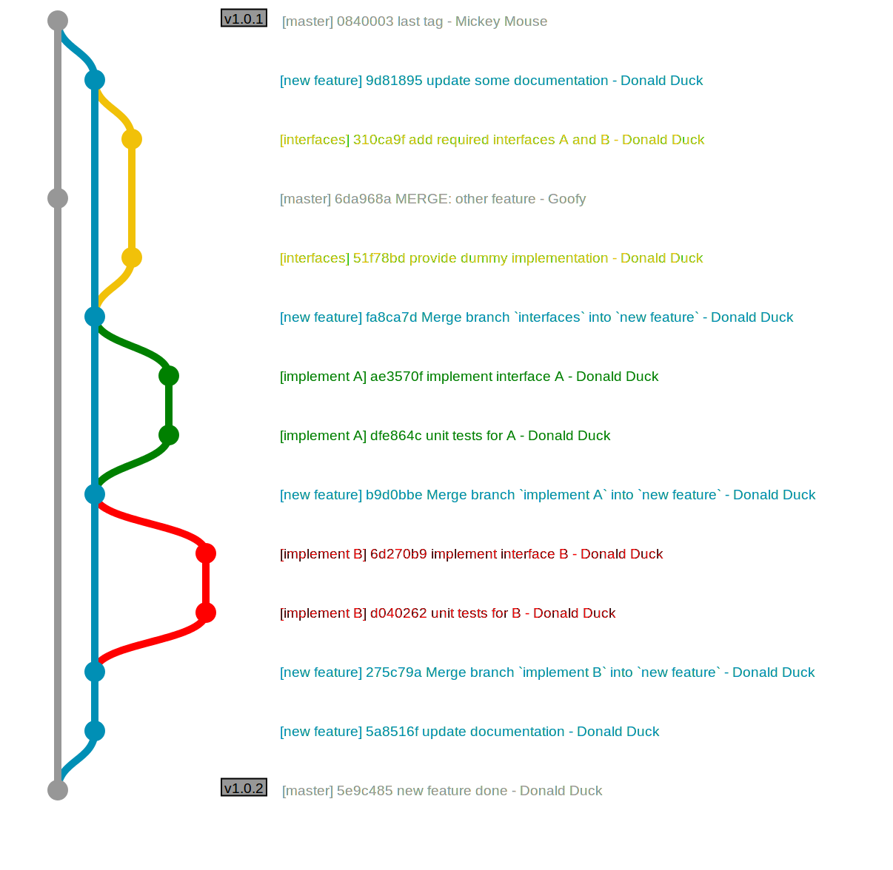
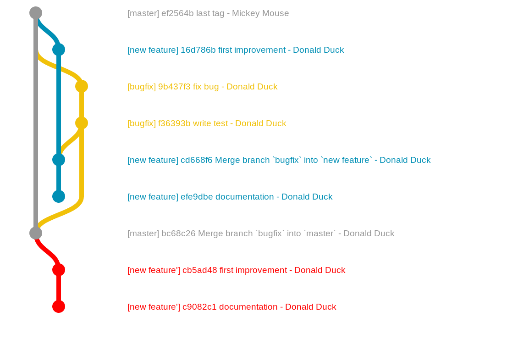
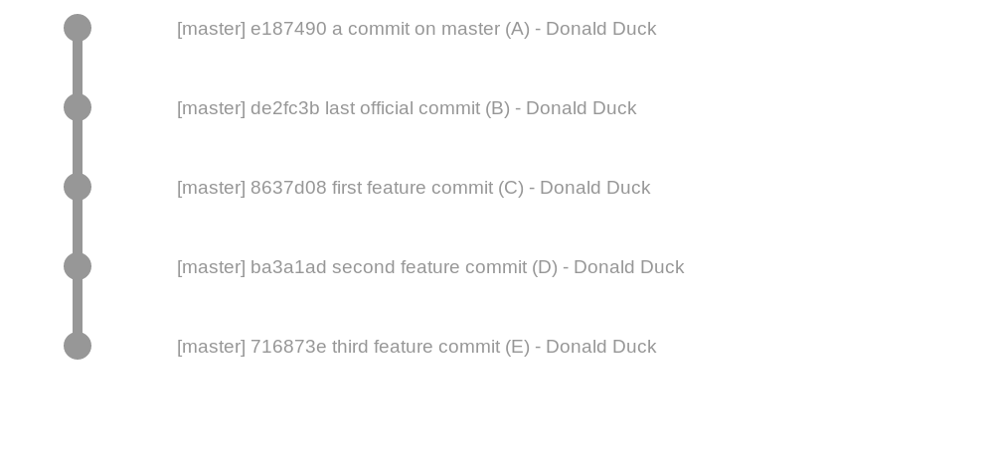
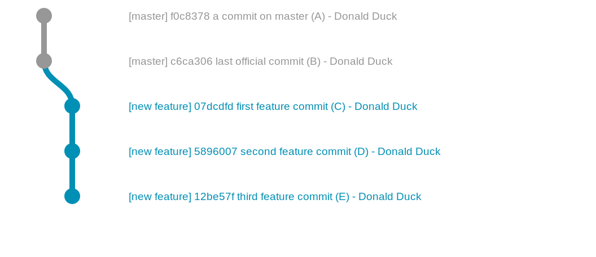

# Contributing to Acts

Contributions to the Acts project are very welcome and feedback on the documentation is greatly appreciated. In order to be able to contribute to the Acts project, developers must have a valid CERN user account. Unfortunately, lightweight CERN accounts for external users do not have sufficient permissions to access certain CERN services used by the Acts project.

1. [Mailing lists](#mailing-lists)
2. [Bug reports and feature requests](#bug-reports-and-feature-requests)
3. [Make a contribution](#make-a-contribution)
    1. [Preparation](#preparation)
    2. [New development](#new-development)
    3. [Creating a merge request](#creating-a-merge-request)
    4. [Using forks](#using-forks)
    5. [Workflow recommendations](#workflow-recommendations)
    6. [Coding style and guidelines](#coding-style-and-guidelines)
    7. [git tips and tricks](#git-tips-and-tricks)
4. [Review other contributions](#review-other-contributions)
    1. [Approving a merge request](#approving-a-merge-request)
    2. [Merging a merge request](#merging-a-merge-request)
5. [Administrator's corner](#admin-corner)
    1. [Making a new Acts release](#tag-release)

## <a name="mailing-lists">Mailing lists</a>

1. [acts-users@cern.ch](https://e-groups.cern.ch/e-groups/Egroup.do?egroupName=acts-users): Users of the Acts project should subscribe to this list as it provides:
    - regular updates on the software,
    - access to the Acts JIRA project for bug fixes/feature requests,
    - a common place for asking any kind of questions.
1. [acts-developers@cern.ch](https://e-groups.cern.ch/e-groups/Egroup.do?egroupName=acts-developers): Developers are encouraged to also subscribe to this list as it provides you with:
    - a developer role in the Acts JIRA project (allows you to handle tickets),
    - developer access to the [Acts git repository](https://gitlab.cern.ch/acts/acts-core)
    - information about developer meetings,
    - a common place for technical discussions.

## <a name="bug-reports-and-feature-requests">Bug reports and feature requests</a>

If you want to report or start a feature request, please open a ticket in the [Acts JIRA](https://its.cern.ch/jira/projects/ACTS/) (**Note:** access is restricted to members of the mailing lists mentioned above). A comprehensive explanation will help the development team to respond in a timely manner. Therefore, the following details should be mentioned:

- bug reports
    - issue type: "Bug"
    - summary: short description of the problem
    - priority: will be set by the development team
    - components: if known, part of Acts affected by this bug; leave empty otherwise
    - affects version: version of Acts affected by this bug
    - a detailed description of the bug including a receipe on how to reproduce it and any hints which may help diagnosing the problem
- feature requests
    - issue type: "Improvement" or "New Feature"
    - summary: short description of new feature
    - priority: will be set by the development team
    - a detailed description of the feature request including possible use cases and benefits for other users

## <a name="make-a-contribution">Make a contribution</a>

The instructions below should help you getting started with development process in the Acts project. If you have any questions, feel free to ask [acts-developers@cern](mailto:acts-developers@cern.ch) for help or guidance.

The Acts project uses a git repository which is hosted on the CERN GitLab server. In order to be able to push your changes and to create merge requests (and thus, contribute to the development of Acts), you must be subscribed to acts-developers@cern.ch.
A general introduction to the GitLab web interface can be found [here](http://gitlab.cern.ch/help/gitlab-basics/README). Very nice tutorials as well as explanations of concepts and workflows with git can be found on [Atlassian](http://www.atlassian.com/git/). For a shorter introduction and the full git documentation have a look at the [git tutorial](http://git-scm.com/docs/gittutorial).

### <a name="preparation">Preparation</a>

#### Configuring git

Commits to repositories on the CERN GitLab server are only accepted from CERN users. Therefore, it is important that git is correctly configured on all machines you are working on. It is necessary to that the git user email address to the primary email address of your CERN account (usually: firstname.lastname@cern.ch). You can check the current values with:

```bash
git config user.name
git config user.email
```

You can change those settings by either editing the `.gitconfig` file in your home directory or by running:

```bash
git config user.name
git config --global user.name "Donald Duck"
git config --global user.email "donald.duck@cern.ch"
```

Further recommended settings are:

```bash
git config user.name
git config --global push.default simple
git config --global pull.rebase true
```

#### Getting a local working copy

As a first step, you need to clone the Acts repository which gives you a local, fully functional and self-contained git repository. This means you can work locally (commit changes, compare versions, inspect the history) while being offline. An internet connection is only required for *pull*ing in new updates or *push*ing your changes to the Gitlab server.

```bash
git clone <ACTS_URL> <DESTINATION>
```

- &lt;ACTS_URL&gt; can be found on the project page of the [Acts git repository](https://gitlab.cern.ch/acts/acts-core). There are different URLs for different authentication methods.
- &lt;DESTINATION&gt; is optional and gives the path on your local machine where the clone will be created.

### <a name="new-development">Starting a new development</a>

When you start a new development, you should make sure to start from the most recent version. Therefore, you need to *fetch* the latest changes from the remote repository by running from inside the Acts directory:

```bash
git fetch origin
```

Now you can create a new branch for your development using

```bash
git checkout -b <BRANCH_NAME> <UPSTREAM> --no-track
```

Let's go through the options one by one:

- `-b <BRANCH_NAME>` creates a new branch called &lt;BRANCH_NAME&gt;.
- `<UPSTREAM>` specifies the starting point of the new branch. For feature developments, this should be `origin/master`, for bug fixes in older releases it could also be for instance `origin/release-0.03.X`.
- `--no-track` decouples your local branch from the remote branch. This is helpful because you do not have the permissions to push any commits directly into the remote `master`/`release-X,Y,Z` branch.

### <a name="creating-a-merge-request">Creating a merge request</a>

Once your development is ready for integration, you should open a merge request at the [Acts project](https://gitlab.cern.ch/acts/acts-core) ([GitLab Help: Create a merge request](https://gitlab.cern.ch/help/gitlab-basics/add-merge-request)). The target branch should usually be _master_ for feature requests and _releas-X,Y,Z_ for bugfixes. The Acts projects accepts only fast-foward merges which means that your branch must have been rebased on the target branch. This can be achieved by fetching upstream changes and rebasing afterwards:

```bash
git fetch origin
git checkout <my_feature_branch>
git rebase -i origin/<target_branch>
git push -u origin <my_feature_branch>
```

At this point you should make use of the interactive rebase procedure to clean up your commits (squash small fixes, improve commit messages etc; [Rewriting history](https://robots.thoughtbot.com/git-interactive-rebase-squash-amend-rewriting-history)).
Merge requests are required to close a Acts JIRA ticket. This is achieved by adding e.g. 'fixes ACTS-XYZ' to the end of the merge request description. Please note that JIRA tickets should only be referenced by merge requests and not individual commits (since strictly there should only be one JIRA ticket per merge request). Once the merge request is opened, a continous integration job is triggered which will add multiple comments to the merge request (e.g. build status, missing license statements, doxygen errors, test coverage etc). Please have a look at them and fix them by adding more commits to your branch if needed.
Please find below a short checklist for merge requests.

### <a name="using-forks">Using forks</a>

Users or groups with git experience may prefer to use their own forks of the
Acts project to develop and test their changes before they are integrated back
into the main Acts repository. We assume that you are experienced with a
fork-based workflow in git and only summarise the most important commands at the
end of this section.

As a first step, you need to create your own fork of the Acts project. For doing
this, please go to the [Acts GitLab
page](https://gitlab.cern.ch/acts/acts-core), click on the fork
button, and follow the instructions ([GitLab Help "How to fork a
project"](https://gitlab.cern.ch/help/gitlab-basics/fork-project)).

To enable the CI on your fork, go from your project page to "Settings -> CI / CD",
expand the "Runners" menu and click on "Enable shared Runners" for this project. 

```bash
# adding the central Acts repository as remote
git remote add upstream ssh://git@gitlab.cern.ch:7999/acts/acts-core.git
# get latest upstream changes
git fetch upstream
# start a new development
git checkout -b <BRANCH_NAME> upstream/master --no-track
# code, test, document
# publish your changes to your fork
git push -u origin <BRANCH_NAME>
# open a merge request through the Gitlab web interface

# sync your fork with the upstream repository
git fetch upstream
# checkout the branch you want to sync (usually 'master' or 'release-X.Y.Z')
git checkout <BRANCH>
# merge all upstream changes which must be a fast-forward merge
git merge --ff-only upstream/<BRANCH>
# push the updates to your fork
git push
```


#### Checklist for merge requests

- Your branch has been rebased on the target branch and can be integrated through a fast-forward merge.
- A detailed description of the merge request is provided which includes a reference to a JIRA ticket (e.g. `Closes ACTS-1234`, [GitLab Help: Closing JIRA tickets](http://docs.gitlab.com/ee/project_services/jira.html#closing-jira-issues)).
- All files start with the MPLv2 license statement.
- All newly introduced functions and classes have been documented properly with doxygen.
- Unit tests are provided for new functionalities.
- For bugfixes: a test case has been added to avoid the re-appearance of this bug in the future.
- All added cmake options were added to 'cmake/PrintOptions.cmake'.

### <a name="workflow-recommendations">Workflow recommendations</a>

In the following a few recommendations are outlined which should help you to get familiar with development process in the Acts project.

1. **Each development its own branch!**
Branching in git is simple, it is fun and it helps you keep your working copy clean. Therefore, you should start a new branch for every development. All work which is logically/conceptually linked should happen in one branch. Keep your branches short. This helps immensly to understand the git history if you need to look at it in the future.
If projects are complex (e.g. large code refactoring or complex new features), you may want to use _sub_-branches from the main development branch as illustrated in the picture below.


1. **Never, ever directly work on any "official" branch!**
Though not strictly necessary and in the end it is up to you, it is strongly recommended that you never commit directly on a branch which tracks an "official" branch. As all branches are equal in git, the definition of "official" branch is quite subjective. In the Acts project you should not work directly on branches which are **protected** in the CERN GitLab repository. Usually, these are the _master_ and _release-X.Y.Z_ branches. The benefit of this strategy is that you will never have problems to update your fork. Any git merge in your local repository on such an "official" branch will always be a fast-forward merge.

1. **Use atomic commits!**
Similarly to the concept of branches, each commit should reflect a self-contained change. Try to avoid overly large commits (bad examples are for instance mixing logical change with code cleanup and typo fixes).

1. **Write good commit messages!**
Well-written commit messages are key to understand your changes. There are many guidelines available on how to write proper commit logs (e.g. [here](http://alistapart.com/article/the-art-of-the-commit), [here](http://chris.beams.io/posts/git-commit/), or [here](https://wiki.openstack.org/wiki/GitCommitMessages#Information_in_commit_messages)). As a short summary:
    - Structure your commit messages into short title (max 50 characters) and longer description (max width 72 characters)!
      This is best achieved by avoiding the `commit -m` option. Instead write the commit message in an editor/git tool/IDE...
    - Describe why you did the change (git diff already tells you what has changed)!
    - Mention any side effects/implications/consquences!

1. **Prefer git pull --rebase!**
If you work with a colleague on a new development, you may want to include his latest changes. This is usually done by calling `git pull` which will synchronise your local working copy with the remote repository (which may have been updated by your colleague). By default, this action creates a merge commit if you have local commits which were not yet published to the remote repository. These merge commits are considered to contribute little information to the development process of the feature and they clutter the history (read more e.g.  [here](https://developer.atlassian.com/blog/2016/04/stop-foxtrots-now/) or [here](http://victorlin.me/posts/2013/09/30/keep-a-readable-git-history)). This problem can be avoided by using `git pull --rebase` which replays your local (un-pushed) commits on the tip of the remote branch. You can make this the default behaviour by running `git config pull.rebase true`. More about merging vs rebasing can be found [here](https://www.atlassian.com/git/tutorials/merging-vs-rebasing/).
1. **Push your development branches as late as possible!**
Unless required by other circumstances (e.g. collaboration with colleagues, code reviews etc) it is recommended to push your development branch once you are finished. This gives you more flexibility on what you can do with your local commits (e.g. rebase interactively) without affecting others. Thus, it minimises the risk for running into git rebase problems.
1. **Update the documentation!**
Make sure that the documentation is still valid after your changes. Perform updates where needed and ensure integrity between the code and its documentation.

### <a name="coding-style-and-guidelines">Coding style and guidelines</a>

The Acts project uses [clang-format](http://clang.llvm.org/docs/ClangFormat.html) (currently v3.8.0) for formatting its source code. A `.clang-format` configuration file comes with the project and should be used to automatically format the code. There are several instructions available on how to integrate clang-format with your favourite IDE (e.g. [eclipse](https://marketplace.eclipse.org/content/cppstyle), [Xcode](https://github.com/travisjeffery/ClangFormat-Xcode), [emacs](http://clang.llvm.org/docs/ClangFormat.html#emacs-integration)). The Acts CI system will automatically apply code reformatting using the provided clang-format configuration once merge requests are opened. However, developers are strongly encouraged to use this code formatter also locally to reduce conflicts due to formatting issues.

In addition, the following conventions are used in Acts code:

- Class names start with a capital letter.
- Function names start with a lower-case letter and use camel-case.
- Names of class member variables start with `m_`.
- getter methods are called like the corresponding member variable without the prefix 'get' (e.g. `covariance()` instead of `getCovariance()`)
- setter methods use the prefix 'set' (e.g. `setCovariance(...)`)
- passing arguments to functions:
    - by value for simple data types (e.g. int, float double, bool)
    - by constant reference for required input of non-trivial type
    - by (raw) pointer for optional input of non-trivial type
    - only use smart pointers if the function called must handle ownership (very few functions actually do)
- returning results from functions:
    - newly created objects should be returned<br />
      a) as unique pointer if the object is of polymorphic type or its presence is not always ensured<br />
      b) by value if the object is of non-polymorphic type and always exists
    - existing objects (e.g. member variables) should be returned by<br />
      a) const reference for custom types with costly copy constructors<br />
      b) value in all other cases
- writing unit tests:
    - place the source code of the test in the `Tests` directory, with following options:
      a) the naming of most unit test should be `{ClassName}`+`Tests.cpp`
      b) in case specific functionality of a single class is tested in different files, use `{ClassName}`+`{TestType}`+`Tests.cpp`
      c) case the written tests concerns CPU profiling, use `{ClassName}`+`Benchmark.cpp`
    - add the test as `{ClassName}`+`UnitTest` or `{ClassName}`+`{TestType}`+`UnitTest` to the test suite for unit tests
    - add the benchmark executable as `{ClassName}`+`Benchmark` to the `bin/Profiling` folder

- Doxygen documentation:
    - Put all documentation in the header files.
    - Use `///` as block comment (instead of `/* ... */`).
    - Doxygen documentation goes in front of the documented entity (class, function, (member) variable).
    - Use the \@&lt;cmd&gt; notation.
    - Functions and classes must have the \@brief description.
    - Document all (template) parameters using \@(t)param and explain the return value for non-void functions. Mention important conditions which may affect the return value.
    - Use `@remark` to specify pre-conditions.
    - Use `@note` to provide additional information.
    - Link other related entities (e.g. functions) using `@sa`.

### <a name="git-tips-and-tricks">git tips and tricks</a>

The following section gives some advise on how to solve certain situations you may encounter during your development process. Many of these commands have the potential to loose uncommitted data. So please make sure that you understand what you are doing before running the receipes below. Also, this collection is non-exhaustive and alternative approaches exist. If you want to contribute to this list, please drop an email to [acts-developers@cern.ch](mailto:acts-developers@cern.ch).

**Before doing anything**
In the rare event that you end up in a situation you do not know how to solve, get to a clean state of working copy and create a (backup) branch, then switch back to the original branch. If anything goes wrong, you can always checkout the backup branch and you are back to where you started.
**Modify the author of a commit**
If your git client is not correctly set up on the machine you are working on, it may derive the committer name and email address from login and hostname information. In this case your commits are likely rejected by the CERN GitLab server. As a first step, you should correctly configure git on this machine as described above so that this problems does not appear again.
a)  You are lucky and only need to fix the author of the latest commit. You can use `git commit --amend`:

```bash
git commit --amend --no-edit --author "My Name <login@cern.ch>"
```

b) You need to fix (several) commit(s) which are not the current head. You can use `git rebase`:
For the following it is assumed that all commits which need to be fixed are in the same branch &lt;BRANCH&gt;, and &lt;SHA&gt; is the hash of the earliest commit which needs to be corrected.

```bash
git checkout <BRANCH>
git rebase -i -p <SHA>^
```

In the editor opened by the git rebase procedure, add the following line after each commit you want to fix:

```bash
exec git commit --amend --author="New Author Name <email@address.com>" -C HEAD
```

Then continue with the usual rebase procedure.

**Make a bugfix while working on a feature**
    During the development of a new feature you discover a bug which needs to be fixed. In order to not mix bugfix and feature development, the bugfix should happen in a different branch. The recommended procedure for handling this situation is the following:
1. Get into a clean state of your working directory on your feature branche (either by commiting open changes or by stashing them).
1. Checkout the branch the bugfix should be merged into (either _master_ or _release-X.Y.Z_) and get the most recent version.
1. Create a new branch for the bugfix.
1. Fix the bug, write a test, update documentation etc.
1. Open a merge request for the bug fix.
1. Switch back to your feature branch.
1. Merge your local bugfix branch into the feature branch. Continue your feature development.
1. Eventually, the bugfix will be merged into _master_. Then, you can rebase your feature branch on master which will remove all duplicate commits related to the bugfix.

In git commands this looks like:

```bash
git stash
git checkout master && git pull
git checkout -b <bug_fix_branch>
# Implement the bug fix, add tests, commit.
# Open a merge request.
git checkout <feature_branch>
git merge <bug_fix_branch>
# Once the merge request for the bug fix is accepted in the upstream repository:
git fetch
git rebase origin/master
```

This should give the following git history where the initial feature branch is blue, the bugfix branch is yellow and the feature branch after the rebase is red.

**Move most recent commit(s) to new branch**
Very enthusiastic about the cool feature you are going to implement, you started from master and made one (or more) commits for your development. That's when you realised that you did not create a new branch and committed directly to the master branch. As you know that you should not directly commit to any "official" branch, you are desperately looking for a solution. Assuming your current situation is: A -> B -> C -> D -> E where HEAD is pointing to E (= master) and the last "official" commit is B as shown below.

You can resolve this situation by running:

```bash
git checkout <new_branch_name>
git reset --hard <hash of B>
git checkout <new_branch_name>
```

which should give the following situation:

Now, master is pointing to B, HEAD and &lt;new\_branch\_name&gt; are pointing to E and you can happily continue with your work.

## <a name="review-other-contributions">Review other contributions</a>

### <a name="approving-a-merge-request">Approving a merge request</a>

Writing new code is not the only way one can contribute to the Acts project. Another greatly appreciated contribution is looking at other proposed contributions to the project. The more eyeballs look at a piece of code before it is merged into the Acts repository, the smaller the chances that a bug or other unwanted behaviour is accidentally introduced into the Acts codebase. This is why we require that every Acts merge request receives at least one human review before being merged.

You can help reviewing proposed contributions by going to [the "merge requests" section of the Acts Gitlab repository](https://gitlab.cern.ch/acts/acts-core/merge_requests) and having a look at the proposals that are being made here. The present contribution guide should serve as a good indication of what we expect from code submissions. In addition, please look at the merge request itself:

* Does its title and description reflect its contents?
* Is it associated with a JIRA ticket so that we can easily document it in the release notes?
* Do the automated continuous integration tests pass without problems?
* Have all the comments raised by previous reviewers been addressed?

If you are confident that a merge request is ready for integration, please make it known by clicking the "Approve merge request" button of the Gitlab interface. This notifies other members of the Acts team of your decision, and marks the merge request as ready to be merged.

### <a name="merging-a-merge-request">Merging a merge request</a>

If you have been granted merge rights on the Acts repository, you can merge a merge request into the Acts master branch after it has been approved by someone else. In order to give everyone a chance to review the merge request, please wait for at least two days (48h) after the merge request has been submitted before doing so, even if the merge request has been approved by someone before this delay has elapsed.

Gitlab may warn you that a "Fast-forward merge is not possible". This warning means that the merge request has fallen behind the current Acts master branch, and should be updated through a rebase. Please notify the merge request author in order to make sure that the latest master changes do not affect the merge request, and to have it updated as appropriate.

## <a name="admin-corner">Administrator's corner</a>

This section gives useful information to the administrators of the Acts project. For normal developers the sections below are irrelevant.

### <a name="tag-release">Make a new Acts release</a>

In order to release a new version of Acts the following steps need to be taken:

1. Check out all open JIRA issues for the next release in <a href="https://its.cern.ch/jira/projects/ACTS/versions/">JIRA</a>.
2. Create a new branch called <tt>release-X.YY.ZZ</tt> branching off from <tt>origin/master</tt>.
3. In this branch, update the <tt>ACTS_VERSION</tt> variable in the top-level CMakeLists.txt file to <tt>X.YY.ZZ</tt> and commit the change.
4. Pushing this commit to the remote repository should trigger a CI build. Make sure that everything compiles without any warnings and all tests look fine.
5. Create a new annotated tag locally. The tag should have the format <tt>vX.YY.ZZ</tt> and an associated tag message 'version vX.YY.ZZ'.
6. Push the tag to the remote repository. This should trigger a CI job which rebuilds to documentation and deploys it together with a tar file of the source code to the Acts webpage. Make sure that the new release appears under the **Releases** section on the <a href="http://acts.web.cern.ch/ACTS/">Acts webpage</a>.
7. If there is not yet a JIRA version for the next minor release, create it in the <a href="https://its.cern.ch/jira/plugins/servlet/project-config/ACTS/versions">JIRA project administration</a> area (e.g. if 1.23.02 was just released, version 1.23.03 should exist in JIRA for the next minor release for bug fixes).
8. Got to the <a href="https://its.cern.ch/jira/projects/ACTS/versions/">Acts Releases page in JIRA</a> and release the version. Make sure that a correct release data is set and that all open issues get moved to the next major/minor release.
9. From the JIRA release page, copy (all) the HTML code for the release notes. Login to lxplus using the service account <tt>atsjenkins</tt> (<tt>ssh atsjenkins@lxplus.cern.ch</tt>). Create the file <tt>~/www/ACTS/vX.YY.ZZ/ReleaseNotes.html</tt> with the copied HTML code for the release notes. Please make sure that _sub_-tasks appear as nested lists (JIRA unfortunately puts them all on one level in alphabetical order).
10. Check that the release notes appear on the <a href="http://acts.web.cern.ch/ACTS/">Acts webpage</a> and are available from the respective link in the **Releases** section.

