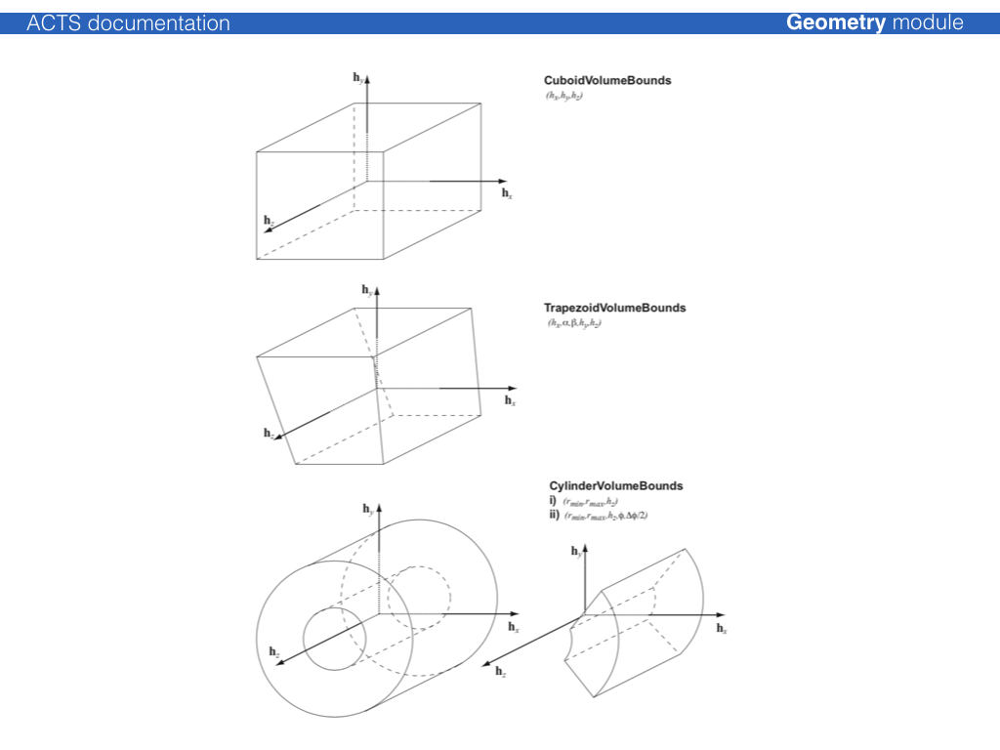

# Volume classes

The {class}`Acts::Volume` class is a container of
{type}`Acts::BoundarySurface` objects, where each
{type}`Acts::BoundarySurface` is an extension of the {class}`Acts::Surface`
class with additional information about the attached volumes. The normal vector
of the surface defines an *inside* (opposite w.r.t. the normal vector) and an
*outside* (along w.r.t. the normal vector) direction. Either a single volume or
an array of volumes can be attached to a volume.

The simples volume class is just a collection of surfaces, where the
{class}`Acts::TrackingVolume` describes a volume that can contain:

* an array of contained layers
* an array of contained volumes (as a container volume)
* an array of contained volumes (as *floating* objects)
* a volume based material description

The shape of the volume is defined by {class}`Acts::VolumeBounds` classes that create the
corresponding bounding surfaces and register the attachment to the volume itself
at creation.

