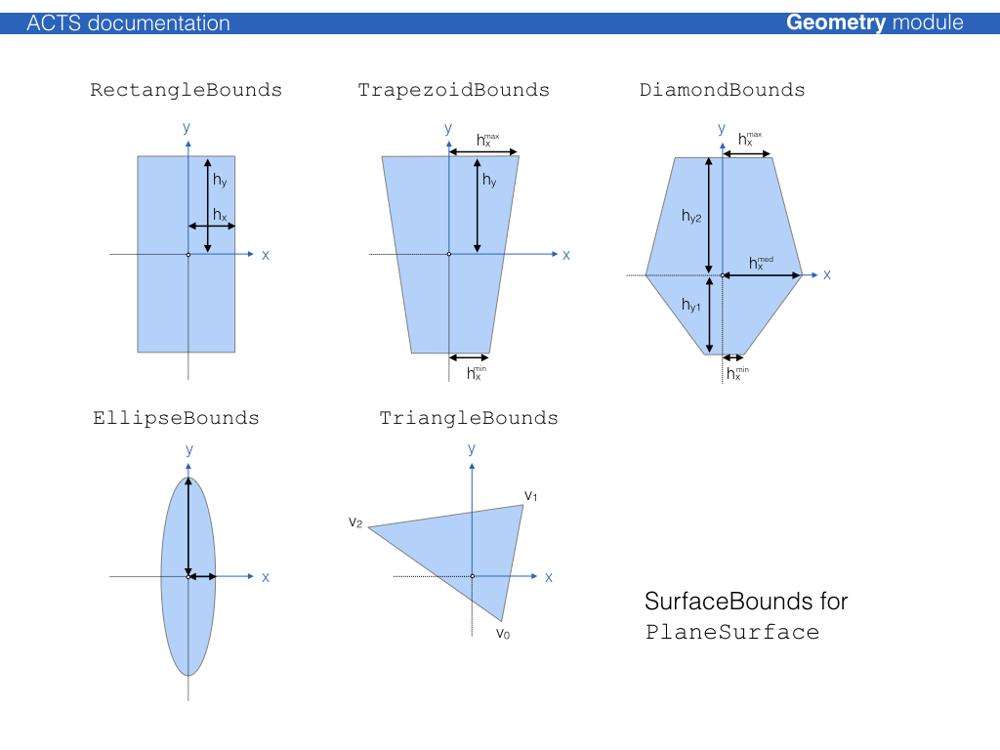
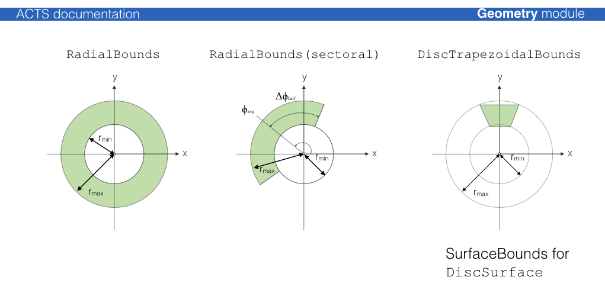
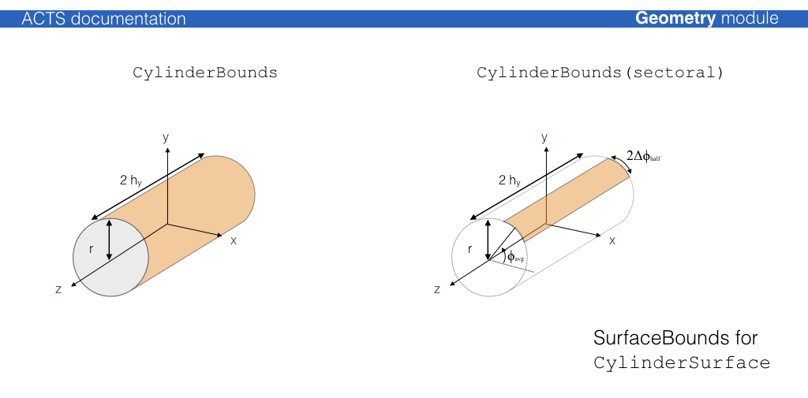

# Surface classes

All classes which represent a thin surface in ACTS inherit from
the common virtual base class {class}`Acts::Surface`, which defines
the public interface of all surfaces. While the different concrete
surface classes are defined by their respective native local
coordinate system, the shapes on these surfaces are defined by classes
that inherit from {class}`Acts::SurfaceBounds`, which every surface must provide.
In case of boundless surfaces, a special {class}`Acts::InfiniteBounds` class is
available.

Each {class}`Acts::Surface` instance reports its type from {func}`Acts::Surface::type()`:

:::{doxygenenum} Acts::Surface::SurfaceType
:::

| Surface Type                                                   | Local Coordinates | Bound Types available                                                                                                           |
|:---------------------------------------------------------------|-------------------|:--------------------------------------------------------------------------------------------------------------------------------|
| {class}`Acts::ConeSurface`                                     | $[r\phi, z]$      | {class}`Acts::ConeBounds`                                                                                                       |
| {class}`Acts::CylinderSurface`                                 | $[r, \phi]$       | {class}`Acts::CylinderBounds`                                                                                                   |
| {class}`Acts::DiscSurface`                                     | $[r, \phi]$       | {class}`Acts::RadialBounds`, {class}`Acts::DiscTrapezoidBounds`                                                                 |
| {class}`Acts::PlaneSurface`                                    | $[x, y]$          | {class}`Acts::RectangleBounds`, {class}`Acts::TrapezoidBounds`, <br>{class}`Acts::InfiniteBounds`, {class}`Acts::EllipseBounds` |
| {class}`Acts::PerigeeSurface`,<br> {class}`Acts::StrawSurface` | $[d, z]$          | {class}`Acts::CylinderBounds`                                                                                                   |
| {class}`Acts::LineSurface`                                     | $[d_0, z_0]$      | {class}`Acts::LineBounds`                                                                                                       |

```{tip}
In an ideal setup, the coordinate systems also define the readout
measurement directions. In such a case, a track prediction from the
propagation will already be in the correct frame of the measurement and
residual or compatibility checks will not need additional coordinate
transformations.
```

## Plane surface



:::{doxygenclass} Acts::PlaneSurface
---

members: globalToLocal,localToGlobal,intersect,normal
---

:::

## Disc surface



:::{doxygenclass} Acts::DiscSurface
---

members: globalToLocal,localToGlobal,intersect,normal,mergedWith
---

:::

## Cylinder surface



:::{doxygenclass} Acts::CylinderSurface
---

members: globalToLocal,localToGlobal,intersect,normal,mergedWith
---

:::

## Cone surface

:::{doxygenclass} Acts::ConeSurface
---

members: globalToLocal,localToGlobal,intersect,normal
---

:::

## Line surface

{class}`Acts::LineSurface` is a special kind of surface that depends on a reference
direction, typically the unit momentum direction $\vec d$ of a particle. A point in
space is considered *on surface* if and only if it coincides with the point of
closest approach between the direction vector $\vec d$ and the line direction
vector $\vec z$. As such, the function {func}`Acts::LineSurface::globalToLocal`
can fail, if the argument position and direction do not fulfill this criterion.
It is pure-virtual, meaning that it can not be instantiated on its own.

:::{doxygenclass} Acts::LineSurface
---

members: globalToLocal,localToGlobal,intersect,normal
---

:::

### Straw surface

:::{doxygenclass} Acts::StrawSurface
---

members: false
---

:::

### Perigee surface

:::{doxygenclass} Acts::PerigeeSurface
---

members: false
---

:::

## API listings

:::{doxygenclass} Acts::Surface
:::
