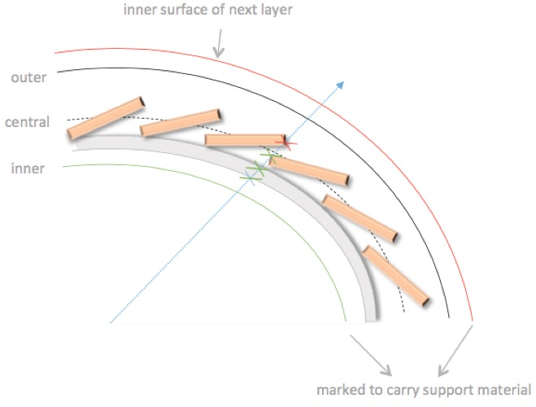
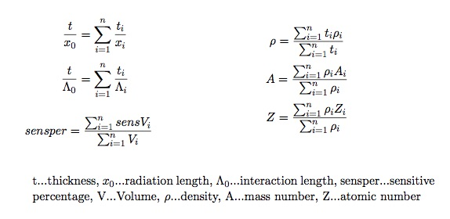

(material-core)=

# Material

## Concept of passive material in tracking

### Projective approximation of passive material

:::{todo}
Link to instructions how to run the material mapping in the examples
:::

### Volume based material description

:::{todo}
Improve material mapping technical description
:::

