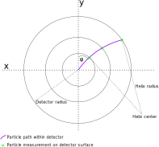
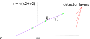

Track Seeding
==============

.. attention::
   This section is largely **outdated** and will be replaced in the future.

To reduce the time needed to reconstruct particle tracks, a track seed
(henceforth: seed) is created which serves as initial direction for the track
reconstruction algorithm (henceforth: the tracking). The tracking then tries to
find all measurements belonging to a single particle in this direction in order
to reconstruct the track. This means, if no seed exists for a particle, this
particle will not be reconstructed. On the other hand, finding too many seeds
which either correspond to a particle for which another seed already exists or
which does not correspond to a particle at all increases the time needed for
tracking.

A good seeding algorithm therefore has the following properties:

#. It finds at least one seed for each particle that should be found
#. It doesn’t find many seeds which do NOT correspond to particles
#. It doesn’t find many seeds per particle

The most typical way to create seeds is to combine measurements. In a homogeneous magnetic field, 3 measurements perfectly describe the helical path of a charged particle. One such triplet of measurements would then constitute a seed and define in close bounds where the tracking needs to look for additional measurements to create a track spanning the whole detector. The difficulty is in choosing the correct measurements, as a helix can be fitted through any 3 measurements in a collision event with potentially tens of thousands of measurements. Therefore, a number of constraints or “cuts” are defined to reduce the number of candidates. Cuts may define where particles originate or the range of energy of particles to be found or otherwise restrict the combination of measurements for seed creation.

Acts Implementation
-------------------

The seeding implementation in Core/include/Acts/Seeding/ is based on the ATLAS track seeding. It was rewritten with a focus on parallelism and maintainability and as detector agnostic as possible, only assuming a (near) homogeneous magnetic field with particles originating from the central detector region. Cuts are configurable and can be plugged in as algorithm which is called by the seeding. The seeding works on measurements or “SpacePoints” (SP), which need to provide x,y,z coordinates with the z axis being along the magnetic field, and x and y. The interaction region must be close to :math:`x=y=0`, such that the interaction region has a smaller detector radius :math:`r = \sqrt{x^2+y^2}` than the measurements closest to the interaction region, see also :numref:`3dim`.

.. figure:: ../figures/seeding/3Dcoordinates.svg
   :name: 3dim
   :align: center
   :width: 600

   Example detector with x,y,z coordinate system. While x and y coordinates must
   be 0 close to the interaction region, z can be arbitrary. The magnetic field
   must be along the z-axis such that charged particles are deflected in \phi
   around the z-axis.

   The same detector as above but in x/y coordinate system. Helices show up as
   circles in this projection, as shown by the purple particle path. Three
   measurements define a circle, which is used to calculate radius
   (corresponding to the particle energy), curvature direction in :math:`\phi`
   corresponding to the particle charge, and impact parameters.

   The same detector as above but mapped onto an r/z coordinate system. This
   projection is used to calculate the pseudorapidity :math:`\eta` of a seed (in
   the code calculated in :math:`cot \theta` for speed), e.g. to test if two
   combinations (SP bottom, SP middle) and (SP middle, SP top) have similar
   pseudorapidity and are therefore compatible with the same particle track.

Three iterators over SP need to be passed to the public createSeedsForGroup
function in the Seedfinder class. The seedfinder will then attempt to create
seeds, with each seed containing exactly one SP returned by each of the three
iterators. 

- SPs from the first iterator are always used as measurement of a seed with the
  smallest detector radius r, 
- SPs from the second iterator are only used as measurement of a seed with r
  between the r of the first and the third iterator
- SPs from the third iterator are always used as measurement with the largest r
  in a seed.

.. warning::
   Note that the seeding algorithm breaks down for particles with a particle
   track whose helix diameter is smaller than the detector radius until which
   seeds are to be created. This is due to ordering assumptions of SP
   locations as well as due to approximations which become inaccurate for
   lower energy particles.

The createSeedsForGroup function then iterates over middle SP, and within this
loop separately iterates once over bottom SP and once over top SP. Within each
of the nested loops, bottom SP - middle SP respectively middle SP - top SP are
tested for compatibility by applying cuts that can be tested with two SP only
(pseudorapidity, origin along z-axis, distance in r between SP).

If both compatible bottom and top SP have been found, test each bottom SP,
middle SP, top SP triplet combination in a triple nested loop. A major part of
this is the calculation of the helix circle. In order to perform calculations
only once, the circle calculation is spread out over the three loops.

.. code-block:: cpp

   for (auto spM : middleSPs) {

     // contains parameters required to calculate circle with linear equation
     // ...for bottom-middle
     std::vector<LinCircle> linCircleBottom;
     // ...for middle-top
     std::vector<LinCircle> linCircleTop;
     transformCoordinates(compatBottomSP, *spM, true, linCircleBottom);
     transformCoordinates(compatTopSP, *spM, false, linCircleTop);

     // create vectors here to avoid reallocation in each loop
     std::vector<const InternalSpacePoint<external_spacepoint_t>*> topSpVec;
     std::vector<float> curvatures;
     std::vector<float> impactParameters;

     std::vector<std::pair<
         float, std::unique_ptr<const InternalSeed<external_spacepoint_t>>>>
         seedsPerSpM;
     size_t numBotSP = compatBottomSP.size();
     size_t numTopSP = compatTopSP.size();

     for (size_t b = 0; b < numBotSP; b++) {
       auto lb = linCircleBottom[b];
       float Zob = lb.Zo;
       float cotThetaB = lb.cotTheta;
       float Vb = lb.V;
       float Ub = lb.U;
       float ErB = lb.Er;
       float iDeltaRB = lb.iDeltaR;

       // 1+(cot^2(theta)) = 1/sin^2(theta)
       float iSinTheta2 = (1. + cotThetaB * cotThetaB);
       // calculate max scattering for min momentum at the seed's theta angle
       // scaling scatteringAngle^2 by sin^2(theta) to convert pT^2 to p^2
       // accurate would be taking 1/atan(thetaBottom)-1/atan(thetaTop) <
       // scattering
       // but to avoid trig functions we approximate cot by scaling by
       // 1/sin^4(theta)
       // resolving with pT to p scaling --> only divide by sin^2(theta)
       // max approximation error for allowed scattering angles of 0.04 rad at
       // eta=infinity: ~8.5%
       float scatteringInRegion2 = m_config.maxScatteringAngle2 * iSinTheta2;
       // multiply the squared sigma onto the squared scattering
       scatteringInRegion2 *=
           m_config.sigmaScattering * m_config.sigmaScattering;

       // clear all vectors used in each inner for loop
       topSpVec.clear();
       curvatures.clear();
       impactParameters.clear();
       for (size_t t = 0; t < numTopSP; t++) {
         auto lt = linCircleTop[t];

         // protects against division by 0
         float dU = lt.U - Ub;
         if (dU == 0.) {
           continue;
         }
         // A and B are evaluated as a function of the circumference parameters
         // x_0 and y_0
         float A = (lt.V - Vb) / dU;
         float S2 = 1. + A * A;
         float B = Vb - A * Ub;
         float B2 = B * B;
         // sqrt(S2)/B = 2 * helixradius
         // calculated radius must not be smaller than minimum radius
         if (S2 < B2 * m_config.minHelixDiameter2) {
           continue;
         }
         // 1/helixradius: (B/sqrt(S2))/2 (we leave everything squared)
         float iHelixDiameter2 = B2 / S2;

To calculate the helix circle in the x-y plane, the x,y coordinates are
transformed into a U/V plane in order to calculate the circle with a linear
instead of a quadratic equation for speed. From the helix circle, particle
energy and impact parameters can be estimated.

The scattering calculation is also spread over the nested loops to avoid
redoing calculations. First, the maximum allowed scattering at the configured
minimum transverse momentum (pT) cut is calculated and scaled by the
pseudorapidity of the bottomSP-middleSP dupletto get the minimum momentum of
the duplet. This duplet's pseudorapidity is used for later calculation of the
scattering for the triplet as well.

.. code-block:: cpp

   // 1+(cot^2(theta)) = 1/sin^2(theta)
   float iSinTheta2 = (1. + cotThetaB * cotThetaB);
   // calculate max scattering for min momentum at the seed's theta angle
   // scaling scatteringAngle^2 by sin^2(theta) to convert pT^2 to p^2
   // accurate would be taking 1/atan(thetaBottom)-1/atan(thetaTop) <
   // scattering
   // but to avoid trig functions we approximate cot by scaling by
   // 1/sin^4(theta)
   // resolving with pT to p scaling --> only divide by sin^2(theta)
   // max approximation error for allowed scattering angles of 0.04 rad at
   // eta=infinity: ~8.5%
   float scatteringInRegion2 = m_config.maxScatteringAngle2 * iSinTheta2;
   // multiply the squared sigma onto the squared scattering
   scatteringInRegion2 *=
       m_config.sigmaScattering * m_config.sigmaScattering;

The following code block calculates if the triplet forms a nearly straight line
in the r/z plane (see :numref:`rz`) as the particle path in the r/z plane is
unaffected by the magnetic field [#f1]_. This is split in two (may be revised
in the future); the first test occurs before the calculation of the helix
circle. Therefore, the deviation from a straight line is compared to the
maximum allowed scattering at minimum pT scaled by the forward angle (as
calculated above). Both the check against min pT as the check against the
calculated pT (discussed further below) take the correlated measurement
uncertainty into account.

.. code-block:: cpp

   // add errors of spB-spM and spM-spT pairs and add the correlation term
   // for errors on spM
   float error2 = lt.Er + ErB +
                  2 * (cotThetaB * lt.cotTheta * varianceRM + varianceZM) *
                      iDeltaRB * lt.iDeltaR;

   float deltaCotTheta = cotThetaB - lt.cotTheta;
   float deltaCotTheta2 = deltaCotTheta * deltaCotTheta;
   float error;
   float dCotThetaMinusError2;
   // if the error is larger than the difference in theta, no need to
   // compare with scattering
   if (deltaCotTheta2 - error2 > 0) {
     deltaCotTheta = std::abs(deltaCotTheta);
     // if deltaTheta larger than the scattering for the lower pT cut, skip
     error = std::sqrt(error2);
     dCotThetaMinusError2 =
         deltaCotTheta2 + error2 - 2 * deltaCotTheta * error;
     // avoid taking root of scatteringInRegion
     // if left side of ">" is positive, both sides of unequality can be
     // squared
     // (scattering is always positive)

     if (dCotThetaMinusError2 > scatteringInRegion2) {
       continue;
     }
   }

Now the check for scattering with calculated particle momentum. Momentum is
calculated from the pT and the pseudorapidity. This must be :math:`\geq` the
lower pT cut, and therefore allows :math:`\leq` scattering compared to the
previous check, as the scattering decreases linearly with particle energy

.. code-block:: cpp

   // calculate scattering for p(T) calculated from seed curvature
   float pT2scatter = 4 * iHelixDiameter2 * m_config.pT2perRadius;
   // TODO: include upper pT limit for scatter calc
   // convert p(T) to p scaling by sin^2(theta) AND scale by 1/sin^4(theta)
   // from rad to deltaCotTheta
   float p2scatter = pT2scatter * iSinTheta2;
   // if deltaTheta larger than allowed scattering for calculated pT, skip
   if ((deltaCotTheta2 - error2 > 0) &&
       (dCotThetaMinusError2 >
        p2scatter * m_config.sigmaScattering * m_config.sigmaScattering)) {
     continue;
   }

The last cut applied in this function is on the so-called impact parameters,
which is the distance of the perigee of a track from the interaction region in
mm of detector radius. It is calculated and cut on before storing all top SP
compatible with both the current middle SP and current bottom SP.

.. code-block:: cpp

   // A and B allow calculation of impact params in U/V plane with linear
   // function
   // (in contrast to having to solve a quadratic function in x/y plane)
   float Im = std::abs((A - B * rM) * rM);

   if (Im <= m_config.impactMax) {
     topSpVec.push_back(compatTopSP[t]);
     // inverse diameter is signed depending if the curvature is
     // positive/negative in phi
     curvatures.push_back(B / std::sqrt(S2));
     impactParameters.push_back(Im);
   }

The bottom SP and middle SP as well as the collection of top SP is passed to
SeedFilter::filterSeeds_2SpFixed, whose collected output for the current middle
SP with all compatible bottom SP and top SP is then passed to
SeedFilter::filterSeeds_1SpFixed.

SeedFilter::filterSeeds_2SpFixed
--------------------------------

This function assigns a weight (which should correspond to the likelihood that
a seed is good) to all seeds and calls the detector specific cuts to apply a
hard cut or modify the weight. The weight is a “soft cut”, in that it is only
used to discard tracks if many seeds are created for the same middle SP in
SeedFilter::filterSeeds_1SpFixed

The weight is influenced by:

#. The impact parameter (the higher the distance the worse)
#. The number of seeds which may belong to the same particle track
#. Optional detector specific cuts.

The impact parameter is multiplied by the configured factor and subtracted from
the weight, as seeds with higher impact parameters are assumed to be less
likely to stem from a particle than another seed using the same middle SP with
smaller impact parameters.

The number of seeds only differing in top SP which have similar helix radius
and the same sign (i.e. the same charge) is used to increase the weight, as it
means that more than three measurements that may be from the same particle have
been found. The measurements must have a minimum distance in detector radius,
such that measurements from the same layer cannot be counted towards the
increased weight. The number of found compatible seeds is multiplied by a
configured factor and added to the weight.

The optional detector specific cuts can use the weight from 1. and 2. and the
three SP to apply a hard cut or change the weight of a seed.

SeedFilter::filterSeeds_1SpFixed
--------------------------------

This function allows the detector specific cuts to filter on the basis of all
seeds with a common middle SP and limits the number of seeds per middle SP to
the configured limit. It sorts the seeds by weight and, to achieve a
well-defined ordering in the rare case weights are equal, sorts them by
location. The ordering by location is only done to make sure reimplementations
(such as the GPU code) are comparable and return the bitwise exactly same
result.

Footnotes
---------

.. [#f1] approximately, this is one of the reasons the algorithm breaks down for low energy particles.

