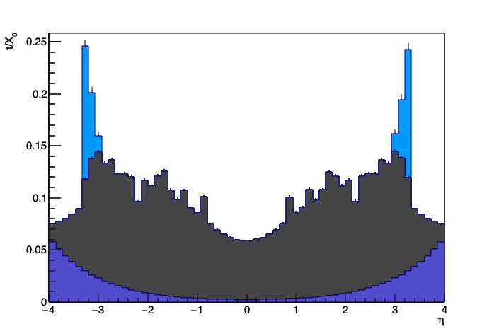
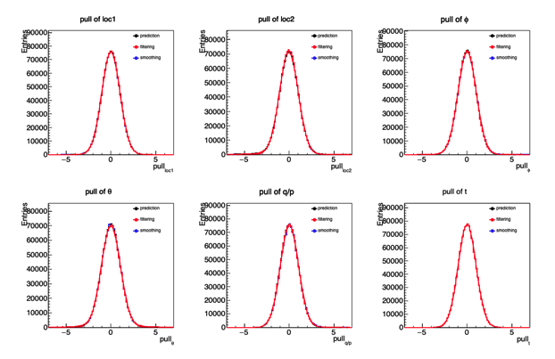
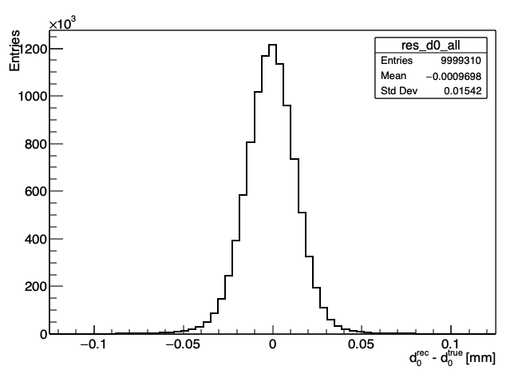
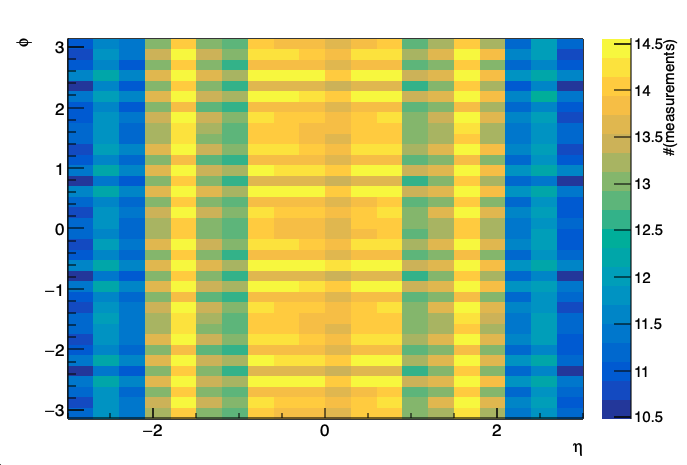

.. _analysis_apps:

Analysis applications
================================

The ACTS examples come with a certain variety of ROOT based validation and performance writers,
whose output can be use to understand various aspects of the reconstruction in more detail.

The building of these applications can be switched on by setting ``ACTS_BUILD_ANALYSIS_APPS=On``,
which requires (on top of the Core dependencies) ROOT for the analysis code.

These analysis applications are steered via BOOST program options, hence a quick ``<APP> -h`` will
quickly show the relevant options, they can be executed in silent mode, i.e. without opening
a window, when specifying the `-s` option.

Material Composition Analysis
-----------------------------

This analysis allows to inspect the output of the ``Geant4`` based material recording, and split
the contained material by atomic number in predefined detector regions. For the moment, the detector
regions need to be identified and constraint in the ``rz`` plane.

.. code-block:: console

    *** Material Composition plotting
    *** Usage::
    -h [ --help ]                           Display this help message
    -s [ --silent ]                         Silent mode (without X-window/display).
    -i [ --input ] arg                      Input ROOT file containing the input TTree.
    -t [ --tree ] arg (=material-tracks)    Input TTree name.
    -o [ --output ] arg                     Output ROOT file with histograms
    -b [ --bins ] arg (=60)                 Number of bins in eta/phi
    -e [ --eta ] arg (=4)                   Eta range.
    --sub-names arg                         Subdetector names.
    --sub-rmin arg                          Minimal radial restrictions.
    --sub-rmax arg                          Maximal radial restrictions.
    --sub-zmin arg                          Minimal z radial restrictions
    --sub-zmax arg                          Maximal z radial restrictions.

For the output of the material recording, of e.g. the ``OpenDateDetector``, the following command
will create a material composition plot of the entire detector:

.. code-block:: console

    $ <build>/bin/ActsAnalysisMaterialComposition \
        -i geant4_material_tracks.root \
        -t material-tracks \
        -o material_composition.root \
        --sub-names beampipe detector \
        --sub-rmin 0.:0. \
        --sub-rmax 30.:1100 \
        --sub-zmin -4000.:-4000. \
        --sub-zmax 4000.:4000.

The output file ``material_composition.root`` would then contain profile histograms versus pseudorapidity
and azimuthal angle ``phi`` for the radiation length ``X0`` and the nuclear interaction length ``L0``,
restricted to the given `rz` regions, in this case only for the beampipe and the entire detector.

The resulting file contains the following histograms:

.. code-block:: console

  KEY: TProfile	beampipe_x0_vs_eta_all;1	X_{0} vs. #eta
  KEY: TProfile	beampipe_l0_vs_eta_all;1	L_{0} vs. #eta
  KEY: TProfile	beampipe_x0_vs_phi_all;1	X_{0} vs. #phi
  KEY: TProfile	beampipe_l0_vs_phi_all;1	L_{0} vs. #phi
  KEY: TProfile	beampipe_x0_vs_eta_A9;1	X_{0} vs. #eta
  KEY: TProfile	beampipe_l0_vs_eta_A9;1	L_{0} vs. #eta
  KEY: TProfile	beampipe_x0_vs_phi_A9;1	X_{0} vs. #phi
  KEY: TProfile	beampipe_l0_vs_phi_A9;1	L_{0} vs. #phi
  KEY: TProfile	detector_x0_vs_eta_all;1	X_{0} vs. #eta
  KEY: TProfile	detector_l0_vs_eta_all;1	L_{0} vs. #eta
  KEY: TProfile	detector_x0_vs_phi_all;1	X_{0} vs. #phi
  KEY: TProfile	detector_l0_vs_phi_all;1	L_{0} vs. #phi
  KEY: TProfile	detector_x0_vs_eta_A9;1	X_{0} vs. #eta
  KEY: TProfile	detector_l0_vs_eta_A9;1	L_{0} vs. #eta
  KEY: TProfile	detector_x0_vs_phi_A9;1	X_{0} vs. #phi
  KEY: TProfile	detector_l0_vs_phi_A9;1	L_{0} vs. #phi
  KEY: TProfile	detector_x0_vs_eta_A12;1	X_{0} vs. #eta
  KEY: TProfile	detector_l0_vs_eta_A12;1	L_{0} vs. #eta
  KEY: TProfile	detector_x0_vs_phi_A12;1	X_{0} vs. #phi
  KEY: TProfile	detector_l0_vs_phi_A12;1	L_{0} vs. #phi
  KEY: TProfile	detector_x0_vs_eta_A13;1	X_{0} vs. #eta
  KEY: TProfile	detector_l0_vs_eta_A13;1	L_{0} vs. #eta
  KEY: TProfile	detector_x0_vs_phi_A13;1	X_{0} vs. #phi
  KEY: TProfile	detector_l0_vs_phi_A13;1	L_{0} vs. #phi
  KEY: TProfile	detector_x0_vs_eta_A27;1	X_{0} vs. #eta
  KEY: TProfile	detector_l0_vs_eta_A27;1	L_{0} vs. #eta
  KEY: TProfile	detector_x0_vs_phi_A27;1	X_{0} vs. #phi
  KEY: TProfile	detector_l0_vs_phi_A27;1	L_{0} vs. #phi
  KEY: TProfile	detector_x0_vs_eta_A28;1	X_{0} vs. #eta
  KEY: TProfile	detector_l0_vs_eta_A28;1	L_{0} vs. #eta
  KEY: TProfile	detector_x0_vs_phi_A28;1	X_{0} vs. #phi
  KEY: TProfile	detector_l0_vs_phi_A28;1	L_{0} vs. #phi
  KEY: TProfile	detector_x0_vs_eta_A48;1	X_{0} vs. #eta
  KEY: TProfile	detector_l0_vs_eta_A48;1	L_{0} vs. #eta
  KEY: TProfile	detector_x0_vs_phi_A48;1	X_{0} vs. #phi
  KEY: TProfile	detector_l0_vs_phi_A48;1	L_{0} vs. #phi
  KEY: TProfile	detector_x0_vs_eta_A64;1	X_{0} vs. #eta
  KEY: TProfile	detector_l0_vs_eta_A64;1	L_{0} vs. #eta
  KEY: TProfile	detector_x0_vs_phi_A64;1	X_{0} vs. #phi
  KEY: TProfile	detector_l0_vs_phi_A64;1	L_{0} vs. #phi

Only histograms with non-zero contribution are written out per specified region,
the following shows a resulting stacked histogram showing different components:



The source code for this application can be found in ``Examples/Scripts/MaterialMapping``.


Tracking Performance Analysis
-----------------------------

Two different applications are available for analysing the output of track fitting and
track finding, sitting on top of the corresponding ROOT output writers from the Example
applications.


**Residuals and Pull analysis per layer**

To investigate the per layer residual and pull distributions, one can use the
`ActsAnalysisResidualAndPulls` application, which runs on top of the ROOT file
produced by the ``RootTrackStatesWriter``.


The following options are available:

.. code-block:: console

    *** ACTS Residual and Pull plotting
    *** Usage::
    -h [ --help ]                    Display this help message
    -s [ --silent ]                  Silent mode (without X-window/display).
    -i [ --input ] arg               Input ROOT file containing the input TTree.
    -t [ --tree ] arg (=trackstates) Input TTree name.
    -o [ --output ] arg              Output ROOT file with histograms
    --predicted                      Analyze the predicted parameters.
    --filtered                       Analyze the filtered parameters.
    --smoothed                       Analyze the smoothed parameters.
    --fit                            Fit the smoothed parameters.
    --save arg (=png)                Output save format (to be interpreted by
                                       ROOT).

Again, this application is capable of running in silent mode (``-s``) without
opening a dedicated screen window.

Originally designed for the ``Acts::KalmanFilter`` output, it is capable of
producing histograms of the ``--predicted``, ``--filtered`` and ``--smoothed`` track
states (i.e. track parameters) and will do so per layer and volume.

On request (``--fit``) the resulting distributions can be fitted for the summary plots
that are created, otherwise the RMS and its mean are taken.

The application will (by parsing the geometry id range) automatically determine the different
layers and volumes and create detailed and summary plots for all of them.

As a example, the pull distributions for *predicted, filtered* and *smoothed* track states
is shown below.




**Track summary analysis**

A higher level view of the track reconstruction performance is the ``ActsAnalysisTrackSummary`` application,
which runs on top of the `RootTrackSummaryWriter` output of the examples code.

The following options are available:

.. code-block:: console

	*** ACTS Perigee parameters and Track summary plotting
	*** Usage::
	  -h [ --help ]                         Display this help message
	  -s [ --silent ]                       Silent mode (without X-window/display).
	  -n [ --events ] arg (=0)              (Optionally) limit number of events to
	                                        be processed.
	  -p [ --peak-events ] arg (=0)         (Optionally) limit number of events for
	                                        the range peaking.
	  -i [ --input ] arg                    Input ROOT file(s) containing the input
	                                        TTree.
	  -t [ --tree ] arg (=tracksummary)     Input TTree/TChain name.
	  -o [ --output ] arg                   Output ROOT file with histograms
	  --hist-bins arg (=61)                 Number of bins for the residual/pull
	                                        histograms
	  --pull-range arg (=5)                 Number of sigmas for the pull range.
	  --eta-bins arg (=10)                  Number of bins in eta.
	  --eta-range MIN:MAX (=-3:3)           Range for the eta bins.
	  --phi-bins arg (=10)                  Number of bins in phi.
	  --phi-range MIN:MAX (=-3.14159:3.14159)
	                                        Range for the phi bins.
	  --pt-borders arg                      Transverse momentum borders.
	  --config-output arg                   (Optional) output histogram
	                                        configuration json file.
	  --config-input arg                    (Optional) input histogram
	                                        configuration json file.
	  --all                                 Process all residual/pull and auxiliary
	                                        parameters
	  --d0                                  Residual/pulls for d0
	  --z0                                  Residual/pulls for z0
	  --phi0                                Residual/pulls for phi0
	  --theta0                              Residual/pulls for theta0
	  --qop                                 Residual/pulls for qop
	  --time                                Residual/pulls for time
	  --pt                                  Residual/pulls for pt
	  --chi2ndf                             Auxiliary information for chi2ndf
	  --measurements                        Auxiliary information for measurements
	  --holes                               Auxiliary information for holes
	  --outliers                            Auxiliary information for outliers
	  --shared                              Auxiliary information for shared

This application is highly configurable and produces residual and pull
(regional, integral and summary) plots for the fitted perigee parameters of track fitting.
It can be run in ```eta,phi,pT``` bins, and as the different histograms in the various bins
will require different histogram ranges, these will be automatically determined.

However, this process is relatively slow and makes comparisons between runs difficult,
thus the range configuration can be written out by specifying a ``--config-output`` JSON file,
and successively re-using it with a ``--config-input`` flag in future analysis runs.

For very large files, the number of entries used for range calculation (peak entries) can be set
using the ``--peak-events`` option.

Some example histograms (transverse impact parameter ``d0`` distribution or a summary plot showing
the number of detector hits, are added below).







The source code for these applications can be found in ``Examples/Scripts/TrackingPerformance``.
