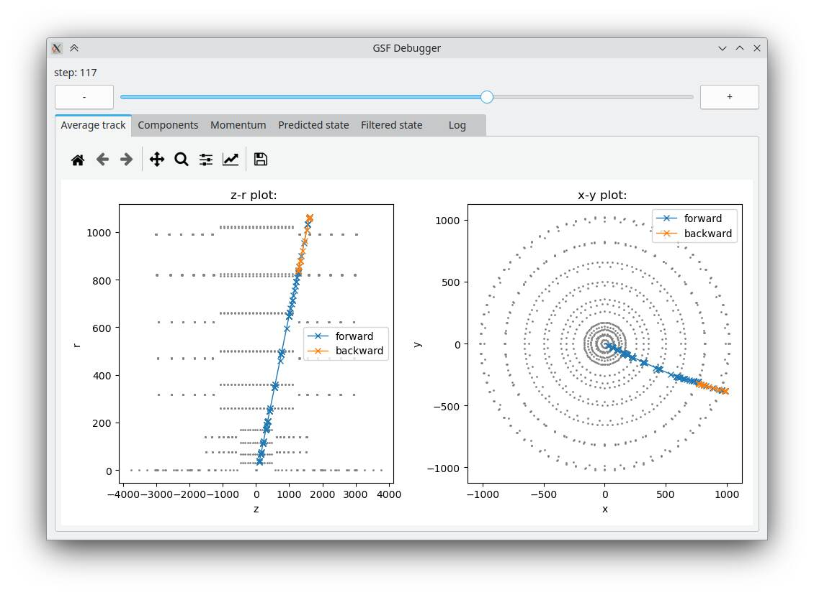
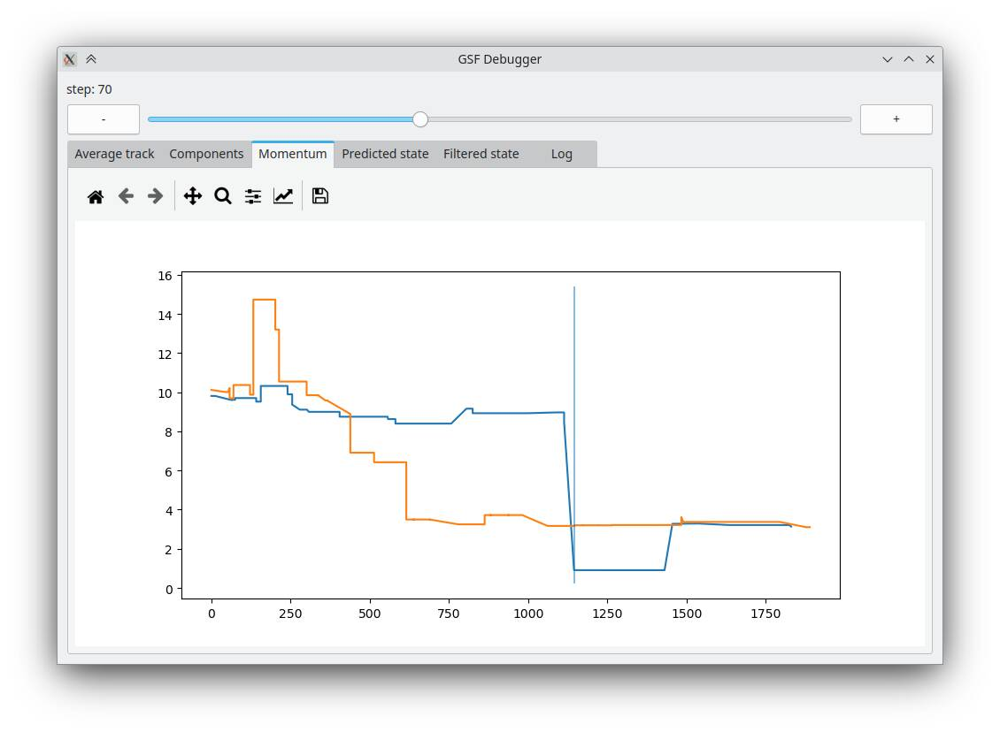
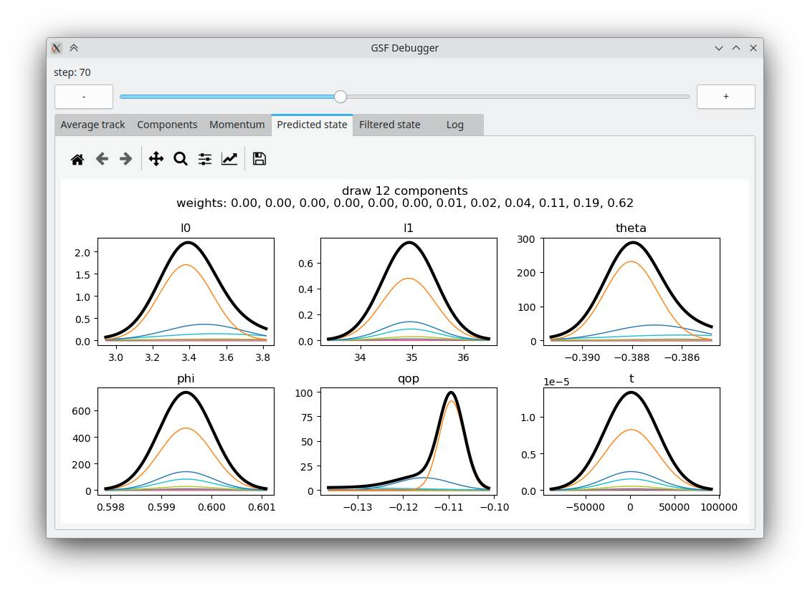
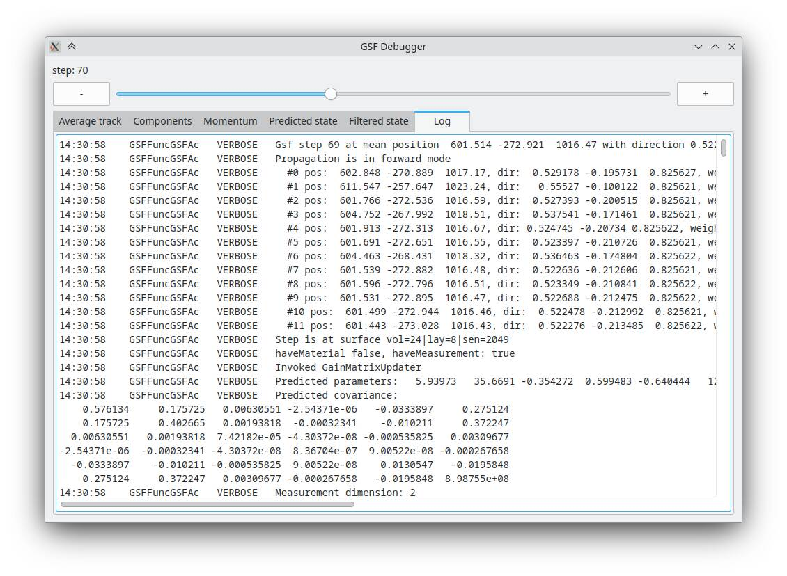
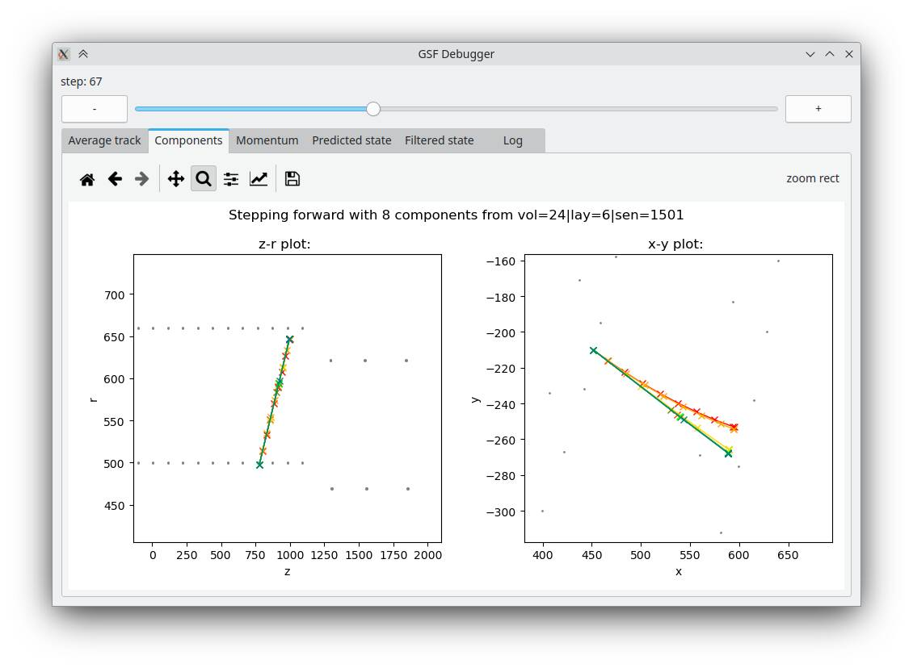

# GSF Debugger

Python utility to visualize the `VERBOSE` log of a GSF track in ACTS. In general, the infrastructure could be used to also display tracks of other fitters with little adjustments.

## Usage

In order to run, the utility requires a logfile and a geometry description as CSV file (this can be produced using the CSV geometry writer in the examples framework):

```bash
python3 acts/Examples/Scripts/GsfDebugger/src/main.py --logfile <path-to-logfile> --detector <path-to-detector-csv>
```

Alternatively, it can also used via piping:
```bash
./my_gsf_script.py | acts/Examples/Scripts/GsfDebugger/src/main.py --detector <path-to-detector-csv>
```

## Screenshots

This section shows some screenshots of the provided views:










