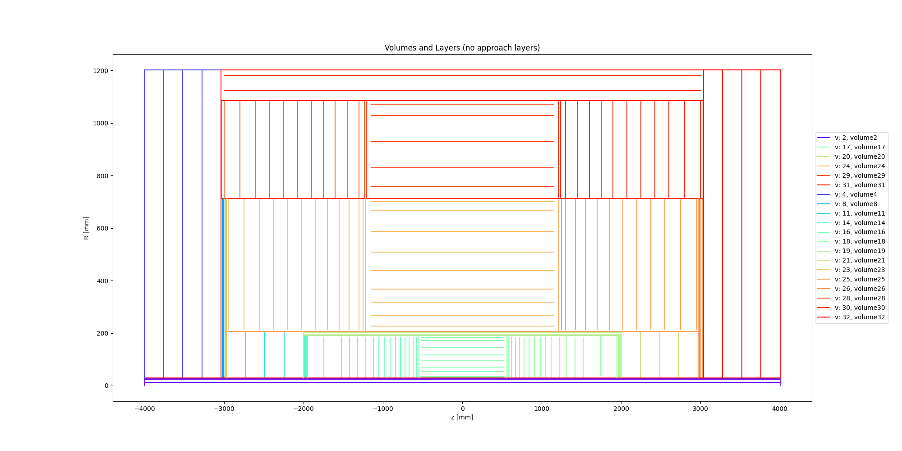
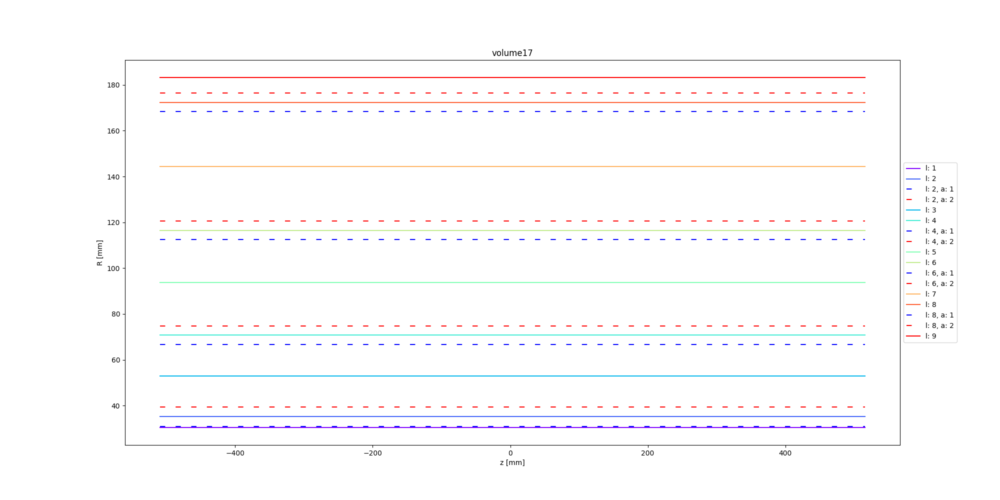
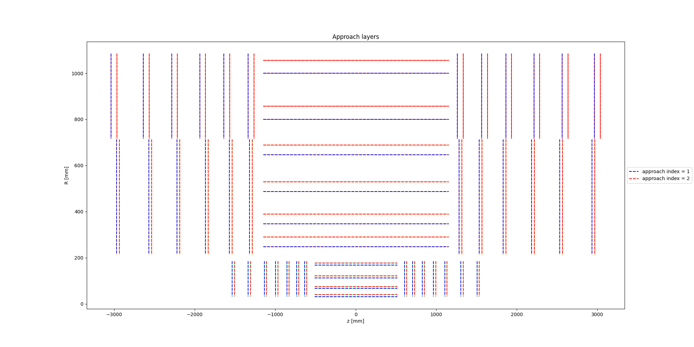
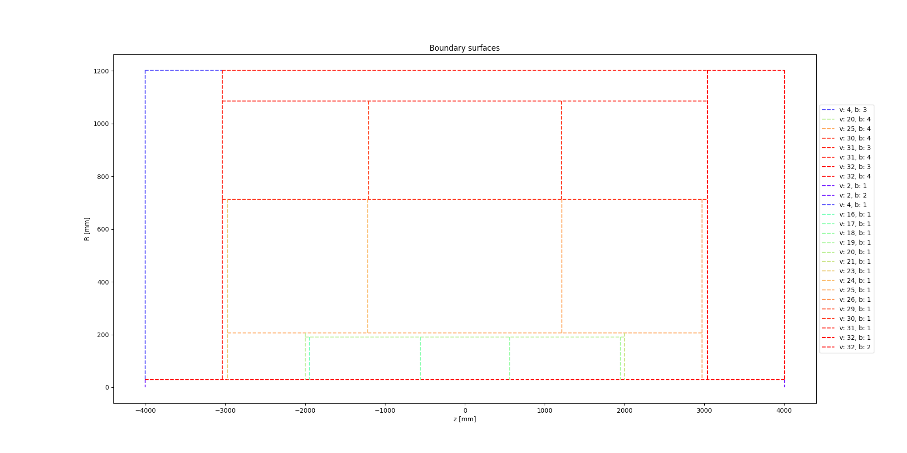

.. _material_mapping_howto_examples:

Howto run the material mapping and validation
=============================================

.. note::
   This documentation is for running the material mapping in the Examples framework.
   Documentation on how to use the Core library directly for material mapping is found :ref:`here<material_mapping_howto_core>`.

When performing track reconstruction, the proper amount of material crossed by the particle needs to be accounted for. This material is originally available in the detector simulation with a lot of details, which would make it expensive to directly use. To circumvent this issue, the material is mapped onto different surfaces in the tracking geometry. This process will be performed in 3 steps:

- first, a JSON geometry file is created, it will be used to configure which surface the material is mapped onto and with which binning.
- second, a Geant4 simulation is used to collect the material inside the detector from the detailed geometry.
- third, all the steps are projected onto the closest surfaces (or volume in case of volume mapping) and averaged out over many events to create a map.

This page will explain how to perform the material mapping with the ACTS Examples. For this example we will use the Open Data Detector (ODD) the last paragraph will explain what needs to be changed if you want to perform the material mapping with another detector.

Prerequisites
-------------
As a prerequisite you will need to build ACTS with the Examples, Geant4 and the JSON plugin (``ACTS_BUILD_EXAMPLES``, ``ACTS_BUILD_EXAMPLES_GEANT4`` and ``ACTS_BUILD_PLUGIN_JSON``) enabled, please refer to the general how-to ACTS guide. Depending on the type of detector you want to map you will need to use some additional packages, in our case ``ACTS_BUILD_EXAMPLES_DD4HEP`` and ``ACTS_BUILD_PLUGIN_ROOT`` are needed.

For this particular example the ODD will also be needed. To use it, don't forget to get the corresponding submodule and then recompile the ACTS code if needed.

.. code-block:: console

   $ git submodule init
   $ git submodule update

Once Acts has been built we can start the mapping. The mapping is divided in two aspects: the surface mapping in which the material is mapped onto the closest surfaces (following the propagation direction) and the volume mapping in which the material is mapped onto a 3D (or 2D) grid associated to a volume. The first step is to select which surfaces and volumes we will want to map material onto. This is done by association of an ``Acts::ProtoSurfaceMaterial`` (or an ``Acts::ProtoVolumeMaterial``) with the surfaces (or volumes) of interest. In the case of the ODD and some other DD4hep detectors this is done at the building step. For other detectors, or if one wants to be able to control precisely which layer will be mapped on and with which binning, an additional step is required.

Mapping and configuration
-------------------------

First we need to extract the list of all the surfaces and volumes in our detector. To do so we will use the ``geometry.py`` script:

.. code-block::

   $ python3 <source>/Examples/Scripts/Python/geometry.py

Ideally the following options should be used in the python file:

.. code-block::

   def runGeometry(
      trackingGeometry,
      decorators,
      outputDir,
      events=1,
      outputObj=False,
      outputCsv=False,
      outputJson=True,
   ):

For the following example we will be remapping the material of the ODD, we will thus get our detector via the following line:

.. code-block::  console

   detector = getOpenDataDetector()
   trackingGeometry = detector.trackingGeometry()
   decorators = detector.contextDecorators()

This algorithm is useful to obtain a visualisation of your detector using the different types of output available (``output-obj`` gives ``.obj`` with a 3D representation of the different subdetectors, for example). Here, we use ``output-json`` to obtain a map of all the surfaces and volumes in the detector with a ``ProtoSurfaceMaterial`` (or a ``ProtoVolumeMaterial``), ``mat-output-allmaterial`` ensure that a ``ProtoSurfaceMaterial`` (or a ``ProtoVolumeMaterial``) is associated to all the surfaces (or volumes), enforcing all of them to be written.
Four types of surfaces exist:

- boundaries which represent the boundaries of the different volumes
- approaches which correspond to the entrance and exist of the detector layer
- representing which correspond to the surface representation of a layer (often positioned at the middle of the 2 approaches)
- sensitives which correspond to the active part of the detector (sensors)

By default, all the surfaces will be written but one can turn a specific type off (for example the sensitive) by using the appropriate option: ``mat-output-XXX false``

The JSON file can now be edited to select which surfaces and volumes you want to have material mapped on. The JSON file is comprise of two parts, the first one contain a list of surfaces and the second a list of volumes. Information of the surface and volumes such as their type, range, id and position are available. To add one surface to the material mapping, one simply needs to switch the ``mapMaterial`` variable to ``true``. The binning can then be changed by changing the number associated to ``bins``, the type of bin can also be changed. For the volume, the same method can be applied, except that up to 3 bins can be associated.
As a rule of thumb volume material should only be used for large homogeneous detector (like calorimeters and gaseous detectors), for the material mapping a good first try would be to use the representing surfaces of the layers with sensors. The binning depends heavily on the geometry and could be of the order of 100 (the more bins are used the more events need to be simulated to populate the bins).

.. warning::
  When mapping onto a surface, the material inside volumes with material (or ``ProtoMaterial``) will be ignored, you should thus avoid mapping material onto surfaces within material volumes. When mapping onto a volume, only the material within that volume will be used. If you have a large gap between the last material surface and the volume you might then want to also map material onto the boundary of the material volume.

In addition to this, the mapping type can be changed for surface mapping by changing the ``mappingType`` variable. Four different types of mapping are available:

- ``PreMapping``: Only map material from before the surface.
- ``Default``: Map material from both before and after the surface
- ``PostMapping``: Only map material from after the surface.
- ``Sensor``: Only map the last material hits before the surface. Used to map only the sensor material onto the sensors.

In case two different surfaces would receive a material hit (Default followed by Default or PreMapping for example), the material hit is associated with the closest surface.

.. warning::
  Due to the implementation, all the material hits need to be associated with a surface. If a PostMapping surface follows a PreMapping or a Sensor surface, all the material between the two surface will be mapped onto the PostMapping surface and a warning will be issued. The same goes if the first surface encountered is a PostMapping surface.

This configuration can be cumbersome to do by hand especially when trying to map on sensitives surfaces. To simplify this task two python scripts are available in ``Examples/scripts/MaterialMapping``:

- ``writeMapConfig.py``
- ``configureMap.py``

The first one take as an input the surfaces map previously generated and will return a JSON config file. In this file you can see all the different types of surfaces associated to each volume. You can then change the binning associated to a surface type. When the second script is called, the resulting map will have the binning applied to all the surface of the corresponding type and ``"mapMaterial"`` will be changed to true. Attention: the ``configureMap.py`` will modify the surfaces map used in input, so you might want to make a copy of it beforehand.

.. code-block:: console

   $ python3 <source>/Examples/Scripts/MaterialMapping/writeMapConfig.py geometry-map.json config-map.json

Then edit the config-map.json file

.. code-block:: console

   $ python3 <source>/Examples/Scripts/MaterialMapping/configureMap.py geometry-map.json config-map.json

Geometry visualisation and preparation of JSON files
~~~~~~~~~~~~~~~~~~~~~~~~~~~~~~~~~~~~~~~~~~~~~~~~~~~~

To help you visualising the geometry and understand the hierarchical structure of volumes and layers, a script has been provided: ``Examples/scripts/MaterialMapping/GeometryVisualisationAndMaterialHandling.py``. The documentation of the module can be printed using:

.. code-block:: console

   $ python3 <source>/Examples/Scripts/MaterialMapping/GeometryVisualisationAndMaterialHandling.py --help

The first thing you can do, is to visualise your geometry with:

.. code-block:: console

   $ python3 <source>/Examples/Scripts/MaterialMapping/GeometryVisualisationAndMaterialHandling.py --geometry <source>/thirdparty/OpenDataDetector/config/odd-material-mapping-config.json

This command produces a series of plots in the output folder ``plot``, or set a different name using ``--output_folder``.

The picture ``volumes_and_layers.png`` show you the volumes and all layers constructed in them:

For each volume containing layers, another picture is produced to show the representative layers (without ``approach`` index) and highlight the ones with ``approach`` index. The picture below show layers for one of the ODD volumes. Knowledge of the approach layers is needed to select the layers you want the material to be mapped onto.

The totality of representative and approach layers is shown in a separate picture ``approach_layers.png``.

Additionally, another picture is produced to visualise boundaries of volumes containing layers.

The same script can be used to dump a steering file that can help you selecting boundaries and approach layers you want the material to be mapped onto, using ``--dump_steering``. At this point you have to edit the steering file which has to contain **ONLY** the structures on which you want to map the material. Once this is done, you can read the steering file with the same python module to produce the final material map file to run material mapping. This is done enabling ``--edit``. At the end of the process, another plot is produced to visualise and validate the structures that will be selected in the mapping procedure to carry material.

Geantino scan
-------------

The next step is to do a geantino scan of our detector. For this we will use the ``material_recording.py`` script:

.. code-block:: console

   $ python3 <source>/Examples/Scripts/Python/material_recording.py

The result of the geantino scan will be a root file containing material tracks. Those contain the direction and production vertex of the geantino, the total material accumulated and all the interaction points in the detector.

Material Mapping
----------------

With the surfaces map and the material track we can finally do the material mapping using the ``material_mapping.py`` script:

.. code-block:: console

   $ python3 <source>/Examples/Scripts/Python/material_mapping.py

Note that technically when using DD4hep (in particular for the ODD) defining a ``matDeco`` in the main function is not strictly necessary as the DD4hep geometry can hold the information of which surface to map onto with which binning. We will ignore this option, since the goal of this guide is to explain how to make a material map regardless of the detector.

As an output you will obtain the material map as a root and JSON file and a new material track collection in a root file. This new collection adds to each material interaction the associated surface during the mapping. This can be used for the control plots.
Depending on what you want to do there are three options you can change:

- ``mapSurface``: determine if material is mapped onto surfaces
- ``mapVolume``: determine if material is mapped onto volumes
- ``mappingStep``: determine the step size used in the sampling of the volume in the volume mapping. By default, the material interaction point obtained from G4 is accumulated at the intersection between the track and the volume material. The mapping will be therefore incorrect if the material extends through the bin. To avoid this, additional material points are created every ``mappingStep`` [mm] along the trajectory. The mapping step should be small compared to the bin size.
- ``readCachedSurfaceInformation`` if added the material-surface association will be taken from the input material track file (doesn't work with geantino file, you need to use the material track file obtained from running the material mapping).

In addition to root and JSON output, one can also output the material map to a Cbor file (Concise Binary Object Representation). Doing so results in a file about 10 time smaller than the JSON one, but that file is no longer human-readable. This should be done once the map has been optimised and you want to export it.

.. note::
  You can map onto surfaces and volumes separately (for example if you want to optimise first one then the other). In that case after mapping one of those you will need to use the resulting JSON material map as an input to the ``mat-input-file``.

.. note::
  You might need to run the material mapping multiple times in a row to optimise the binning for each surface, which can be time-consuming. To improve the speed of subsequent mapping one can turn the ``mat-mapping-read-surfaces`` option to true, with this option the intersection of the material track with the surfaces will be taken directly from the input root file (which would have been updated during the first mapping). This will save the time needed to compute them. This can save up to 50% of the mapping time. Please note that this can only be used if the mapping surfaces used didn't change between this execution and the last.

Material Validation
-------------------

Now that the map has been written, you may want to validate it. First you can use the ``MaterialValidation`` example. This will perform propagation throughout the detector once it has been decorated with the material map. It will then output material tracks with the same format as the one obtain with the Geantino.

By default, the Geantino scan is performed with no spread in :math:`z_0` and :math:`d_0`, while the validation has a spread of 55 mm, to obtain meaningful results, use the same spread for both (in our example a spread of 0). Another difference between the scan and the validation is that the first uses a flat distribution in :math:`\theta` while the second uses a flat distribution in :math:`\eta`, so some reweighing might be necessary when comparing some of the distributions.

.. code-block:: console

   $ python3 <source>/Examples/Scripts/Python/material_validation.py

To do the validation, five root macros are available in ``scripts/MaterialMapping``:

- ``Mat_map.C``: general comparison at the track level and 2D map of the detector.
- ``Mat_map_surface_plot.C``: for each mapped surface show the position of the material.
- ``Mat_map_surface_plot_ratio.C``: material ratio between the truth and the validation for each surface.
- ``Mat_map_surface_plot_dist.C``: position of the Geantino interaction with respect to the surface they are mapped on.
- ``Mat_map_surface_plot_1D.C``: 1D distribution of the material in each surface.

.. code-block:: console

  mkdir Validation

  root -l -b <source>/Examples/Scripts/MaterialMapping/Mat_map.C'("propagation-material.root","material-map_tracks.root","Validation")''
  .q

  mkdir Surfaces
  mkdir Surfaces/prop_plot
  mkdir Surfaces/map_plot
  mkdir Surfaces/ratio_plot
  mkdir Surfaces/dist_plot
  mkdir Surfaces/1D_plot

  root -l -b <source>/Examples/Scripts/MaterialMapping/Mat_map_surface_plot_ratio.C'("propagation-material.root","material-map_tracks.root",100000,"Surfaces/ratio_plot","Surfaces/prop_plot","Surfaces/map_plot")'
  .q
  root -l -b <source>/Examples/Scripts/MaterialMapping/Mat_map_surface_plot_dist.C'("material-map_tracks.root",-1,"Surfaces/dist_plot")'
  .q
  root -l -b <source>/Examples/Scripts/MaterialMapping/Mat_map_surface_plot_1D.C'("material-map_tracks.root",100000,"Surfaces/1D_plot")'
  .q

Using the validation plots you can then adapt the binning and the mapped surface to improve the mapping.

On top of those plots:

.. code-block:: console

  root -l -b <source>/Examples/Scripts/MaterialMapping/Mat_map_detector_plot_ratio.C'("propagation-material.root","material-map_tracks.root",{X,Y,Z},100000,"Det_ratio","Det_Acts","Det_G4")'
  .q

Can be use with X,Y,Z is a list of volumes, this will plot the material ratio between the map and the Geantino scan for the given volumes.

Using a different detector
--------------------------

If you want to use a different type of detector, you will first need to ensure that the relevant packages were added during the compilation. After this you can just replace the detector initialisation in the different main function. For reference you can have a look on the ODD for DD4Hep detector and on the ITk for TGeo detector.
