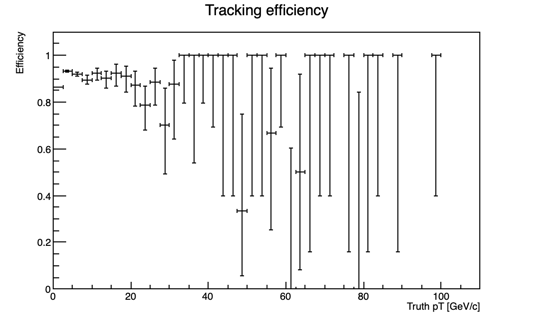
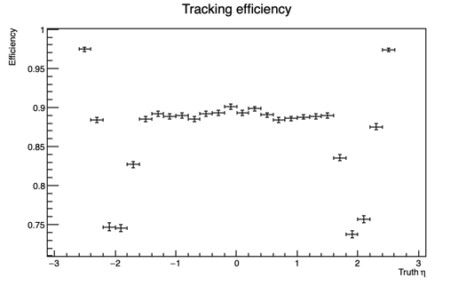

Run the seeding example
=======================

Prerequisites
-------------

ACTS needs to be built with ``ACTS_BUILD_EXAMPLES=ON`` to enable this example.
Before running the seeding example, you have to prepare a simulated dataset. 
The event generation and fatras simulation are explained in :ref:`simulate-TrackML`.

Run the seeding example
-----------------------

Suppose the generated ttbar sample is available at ``data/sim_generic/ttbar_pu200``.
The seed finding example reads the fatras simulation output and creates smeared measurements from the truth hits.
After that, it creates space points from the smeared measurements, and the seed finding algorithm is performed.
The following parameters for the seed finding are set in ``/acts/Examples/Run/Seeding/Common/SeedingExample.cpp``.

.. code-block:: console

  seedingCfg.rMax = 200.;
  seedingCfg.deltaRMax = 60.;
  seedingCfg.collisionRegionMin = -250;
  seedingCfg.collisionRegionMax = 250.;
  seedingCfg.zMin = -2000.;
  seedingCfg.zMax = 2000.;
  seedingCfg.maxSeedsPerSpM = 1;
  seedingCfg.cotThetaMax = 7.40627;  // 2.7 eta
  seedingCfg.sigmaScattering = 5;
  seedingCfg.radLengthPerSeed = 0.1;
  seedingCfg.minPt = 500.;
  seedingCfg.bFieldInZ = 0.00199724;
  seedingCfg.beamPosX = 0;
  seedingCfg.beamPosY = 0;
  seedingCfg.impactMax = 3.;

You can run the seeding example with a command like this:
The detector volumes and layers used in the space point maker are configured using a json file in the source code.

.. code-block:: console

   $ <build>/bin/ActsExampleSeedingGeneric \
	--input-dir=data/sim_generic/ttbar_pu200 \
	--output-dir=output_generic_ttbar_pu200 \
        --bf-constant-tesla=0:0:2 \
	--digi-config-file <source>/Examples/Algorithms/Digitization/share/default-smearing-config-generic.json \
        --geo-selection-config-file <source>/Examples/Algorithms/TrackFinding/share/geoSelection-genericDetector.json

After running this example, you should see something like this:

.. code-block::
   
   SeedingPerfo   INFO      Efficiency (nMatchedParticles / nAllParticles) = 0.910987
   SeedingPerfo   INFO      Fake rate (nUnMatchedSeeds / nAllSeeds) = 0.586774
   SeedingPerfo   INFO      Duplication rate (nDuplicatedMatchedParticles / nMatchedParticles) = 0.778491
   SeedingPerfo   INFO      Average number of duplicated seeds ((nMatchedSeeds - nMatchedParticles) / nMatchedParticles) = 7.59991

This output shows the efficiency, fake rate, and duplicate rate for the selected particles.
The example also generates output root files in the output directory.
In ``performance_seeding.root``, you can find the efficiency plots.
The plots below are examples of the efficiency plots produced using the ttbar sample with 200 pile-up vertices.

