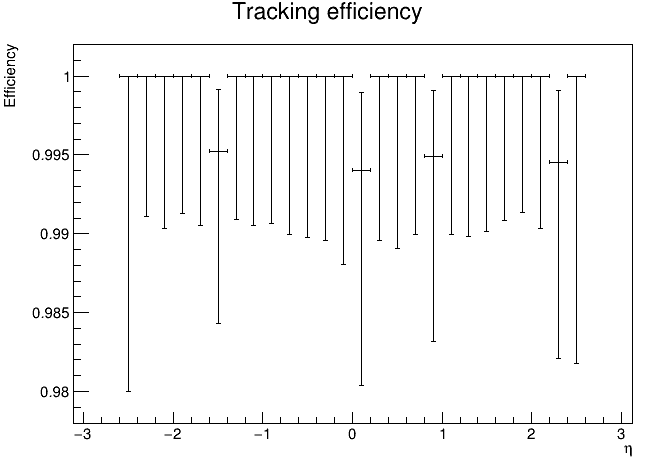
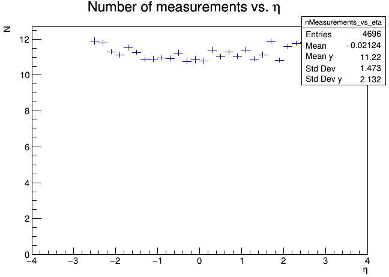
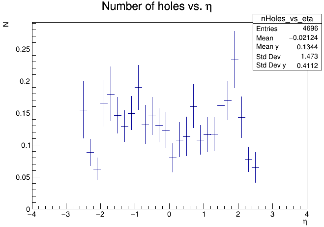
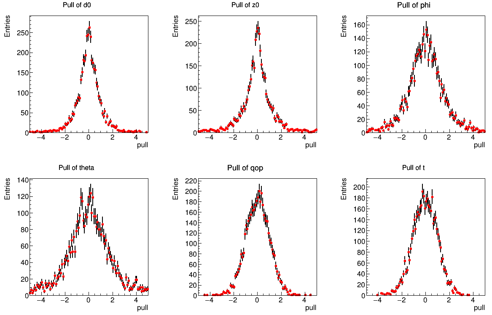

.. _truth-fit-TrackML:

Run the truth tracking examples
===============================

Prerequisites
-------------

Acts must be build with activated examples and Pythia8 support
(``ACTS_BUILD_EXAMPLES_PYTHIA8=on``) to enable the fast simulation. ``<build>``
is used to identify the path to the build directory.

We assume that you have generated a simulation dataset based on the TrackML detector as described in :ref:`simulate-TrackML`. A good example dataset would be e.g. a ttbar sample with pileup 200 in a 2T magnetic field. Suppose the generated ttbar sample is available at ``data/sim_trackML/ttbar_mu200``. 

Run the truth tracking
----------------------

Run the truth tracking tool that reads the simulation output (truth hits and truth particles), creates smeared
measurements from the true hits, creates seeds (i.e. starting track parameters) from the truth particles, builds truth tracks (i.e. uses the truth
information to group simulated hits into tracks) and fits them. 

.. code-block:: console

   $ <build>/bin/ActsExampleTruthTracksGeneric \
       --input-dir=data/sim_trackML/ttbar_mu200 \
       --digi-config-file <source>/Examples/Algorithms/Digitization/share/default-smearing-config-generic.json \
       --bf-constant-tesla=0:0:2 \
       --output-dir=data/reco_trackML/ttbar_mu200

The ``--digi-config-file`` specifies the path for the digitization configuration file. The magnetic field setup should be consistent between simulation and truth tracking. 

Look at the truth tracking performance
--------------------------------------

The truth tracking will generate three root files (the name of those root files are currently not configurable via the command line) in the ``data/reco_trackML/ttbar_mu200``:

*  ``tracks.root`` This includes a tree with one entry representing one trajectory. From this file, one could check the information of every measurement track state on the trajectory.
*  ``performace_track_finder.root`` This includes a tree showing performance of the truth track finding.
*  ``performance_track_fitter.root`` This includes a few histograms showing the residual and pull of the fitted perigee track parameters and efficiency plots showing the fitting efficiency etc.

Example plots to show the fitting efficiency versus eta and pT for ttbar sample generated above:

.. image:: ../../figures/performance/fitter/trackeff_vs_pT_ttbar_pu200.png
   :width: 300

Example plots to show the average number of measurements and holes versus eta for ttbar sample generated above:

To draw the resolution (residual and pull) of fitted perigee track parameters for e.g. ttbar sample, one could use:

.. code-block:: console

 $ root <source>/Examples/Scripts/perigeeParamResolution.C'("rec_ttbar_pu200/performance_track_fitter.root")'

``<source>`` here is used to identify the path of the source directory. 

An example plot of the pull distribution of fitted perigee track parameters for the ttbar sample generated above:

