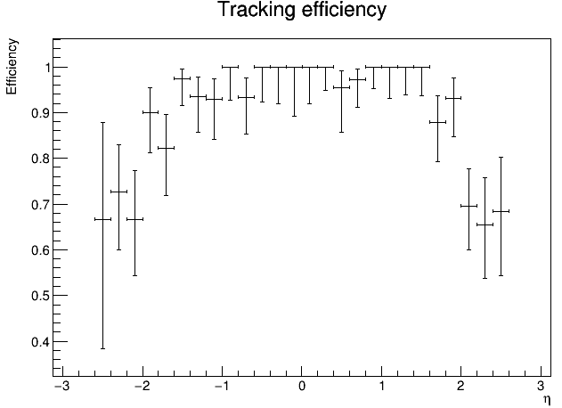
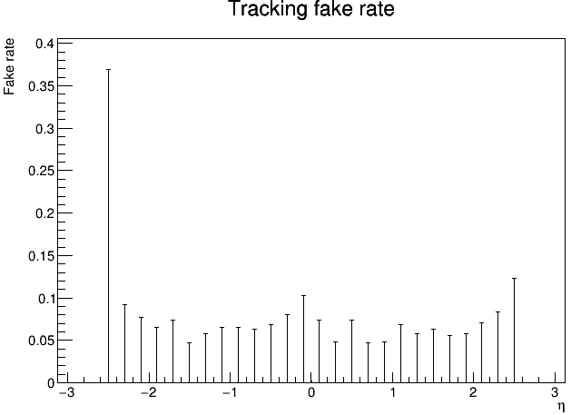
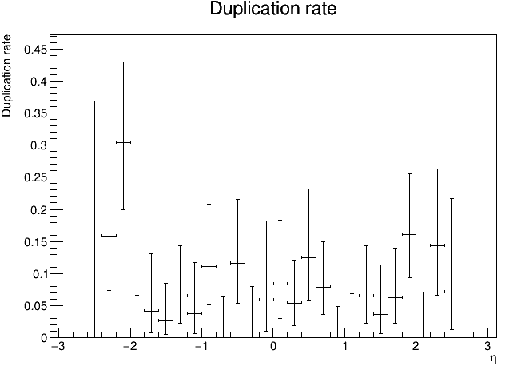

Run the CombinatorialKalmanFilter (CKF) tracking example
===============================

Prerequisites
-------------

Acts must be build with activated examples and Pythia8 support
(``ACTS_BUILD_EXAMPLES_PYTHIA8=on``) to enable the fast simulation. ``<build>``
is used to identify the path to the build directory.

We assume that you have generated a simulation dataset based on the TrackML detector as described in
:ref:`simulate-TrackML`. A good example dataset would be e.g. a ttbar sample with pileup 200 in a 2T magnetic field. Suppose the generated ttbar sample is available at ``data/sim_trackML/ttbar_mu200``.

Run the CKF tracking
----------------------

Run the CKF tracking tool that reads the simulation output (truth hits and truth particles), creates smeared
measurements from the true hits, creates seeds (i.e. starting track parameters) from the pre-selected truth particles, 
and run the CKF which will perform the track finding and track fitting simultaneously:

Currently, there are two configurable criteria to select compatible source links on a surface with track parameters in CKF:

* Global maximum chi2 of Kalman filtering. This could be set up via ``--ckf-slselection-chi2max``
* Global maximum number of source links on a surface. This could be set up via ``--ckf-slselection-nmax`` 

.. code-block:: console

   $ <build>/bin/ActsExampleCKFTracksGeneric \
       --input-dir=data/sim_trackML/ttbar_mu200 \
       --bf-value=0 0 2 \
       --ckf-slselection-chi2max 15 \
       --ckf-slselection-nmax 10 \
       --output-dir=data/reco_trackML/ttbar_mu200

The magnetic field setup should be consistent between simulation and CKF tracking.

Look at the CKF tracking performance
----------------------

The CKF tracking will generate a root file named ``performance_ckf.root`` (the name is currently not configurable via the command line) in the ``data/reco_trackML/ttbar_mu200``.
This file includes a few efficiency plots showing the CKF efficiency, fake rate, duplication rate and other plots showing detailed reconstruction info etc.

Example plots to show the CKF efficiency, fake rate and duplication rate for the ttbar sample generated above:

