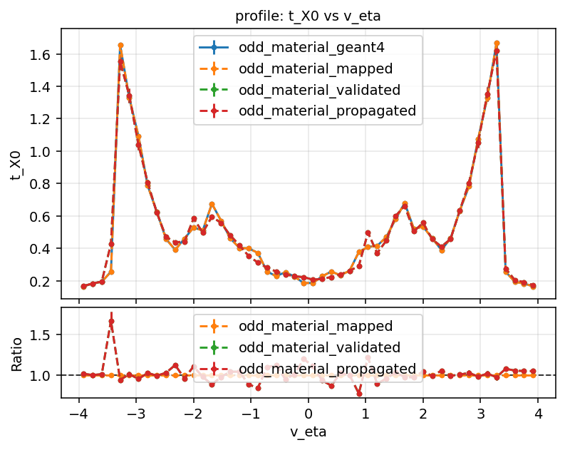

@page material_mapping_workflow Material mapping workflow (source of truth)

# Material mapping workflow (source of truth)

This page is the canonical reference for the ACTS Examples material mapping chain.
It explains the end-to-end logic and points to the concrete scripts and tests that
define current behavior.

## Overview

Material mapping in the Examples pipeline is a three-step process:

1. **Record material in detailed simulation (Geant4)**
   Shoot particles through the detector's full simulation geometry and store
   material interactions per track.

2. **Map recorded material onto ACTS tracking surfaces**
   Collect surfaces configured to carry material (via `ProtoSurfaceMaterial` in
   geometry/material configuration), assign recorded interactions to these
   surfaces, and average into a compact material map.

3. **Validate mapped material**
   Propagate particles through the detector decorated with the produced map and
   record material tracks again for comparison against Geant4-based recording.

## Scripts (ODD workflow)

The following scripts implement the three stages:

- Recording: `Examples/Scripts/Python/material_recording.py`
- Mapping: `Examples/Scripts/Python/material_mapping.py`
- Validation: `Examples/Scripts/Python/material_validation.py`

Example commands (Open Data Detector):

```console
python material_recording.py -n1000 -t1000 -o odd_material_geant4
python material_mapping.py -n 1000000 -i odd_material_geant4.root -o odd_material
python material_validation.py -n 1000 -t 1000 -m odd_material_map.root -o odd_material_validated -p
```

> [!tip]
> Run these from `Examples/Scripts/Python` or prefix each command with
> `python Examples/Scripts/Python/<script>.py ...` from the repository root.

## Step-by-step logic

### 1) Material recording (`material_recording.py`)

- Uses Geant4 material recording to create per-track material information.
- Produces a ROOT file (output stem + `.root`) containing material tracks.
- Typical output for the command above: `odd_material_geant4.root`.

### 2) Material mapping (`material_mapping.py`)

- Reads recorded material tracks (`RootMaterialTrackReader`).
- Collects mappable surfaces from tracking geometry
  (`trackingGeometry.extractMaterialSurfaces()`).
- Builds assignment/accumulation components and performs averaging onto the
  selected surfaces.
- Writes mapped outputs using the chosen output stem:
  - `<stem>_map.root` and/or `<stem>_map.json`
  - `<stem>_mapped.root`
  - `<stem>_unmapped.root`

### 3) Material validation (`material_validation.py`)

- Decorates geometry from `--map`, then validates material response by producing
  material tracks from mapped material.
- Writes `<output>.root` with collection `material_tracks` by default.
- `-p` / `--propagate` enables an additional propagation/navigation-based
  collection, written as `<output>_propagated.root`, useful to expose potential
  navigation-related effects in material collection.

## Comparison example

The figure below overlays Geant4, mapped, validated, and propagated profiles
for `t_X0` vs `eta`, with a ratio panel.



## Tests that guard this workflow

Primary tests live in `Python/Examples/tests`:

- `Python/Examples/tests/conftest.py`
  - `material_recording_session` fixture generates reusable Geant4 material tracks.
- `Python/Examples/tests/test_examples.py`
  - `test_material_recording`
  - `test_material_mapping`
- `Python/Examples/tests/root_file_hashes.txt`
  - Reference hashes for workflow outputs.

These tests are the executable reference for expected output structure and
regression tracking.
