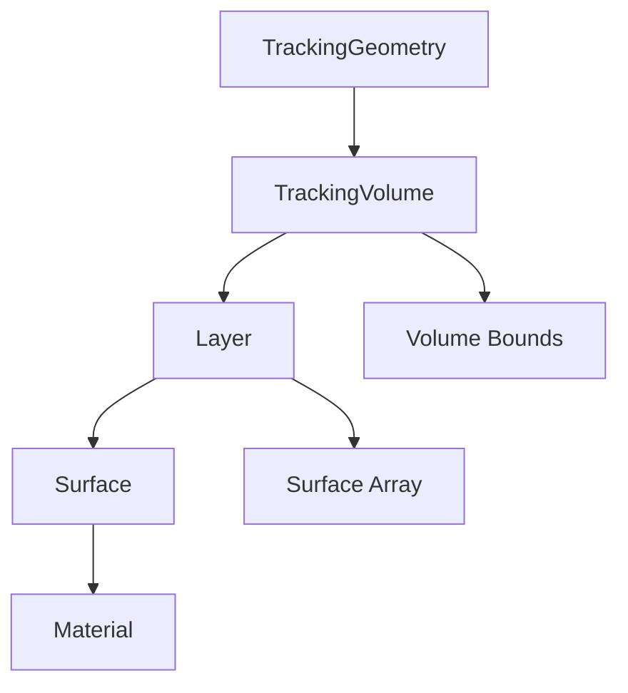

# Geometry System Guide {#geometry_guide}

@tableofcontents

The Acts geometry system provides a flexible and efficient framework for describing detector geometries in high-energy physics experiments.

## Overview

The geometry system consists of several key components:



## Key Classes

### TrackingGeometry

The top-level container for the entire detector description:

@code{.cpp}
#include "Acts/Geometry/TrackingGeometry.hpp"

// Create a tracking geometry
auto tGeometry = Acts::TrackingGeometry::create(worldVolume, materialDecorator);

// Access volumes by position
auto volume = tGeometry->lowestTrackingVolume(globalPosition);
@endcode

### TrackingVolume

Hierarchical volumes that organize the detector:

```cpp
// Volume configuration
Acts::TrackingVolumeConfig config;
config.volumeBounds = std::make_shared<Acts::CylinderVolumeBounds>(rMin, rMax, zHalf);
config.volumeName = "BeamPipe";

// Create volume
auto volume = Acts::TrackingVolume::create(config);
```

### Surface Types

Acts supports multiple surface primitives:

| Surface Type | Use Case | Parameters |
|--------------|----------|------------|
| `PlaneSurface` | Tracker layers | Normal vector, center |
| `CylinderSurface` | Barrel detectors | Radius, z-bounds |
| `DiscSurface` | Endcap detectors | Inner/outer radius |
| `ConeSurface` | Forward tracking | Cone angle, z-vertex |

## Coordinate Systems

### Global Coordinates

The global coordinate system uses:
- **Origin**: Interaction point
- **Z-axis**: Beam direction  
- **X-axis**: Horizontal, pointing away from the center of the ring
- **Y-axis**: Vertical, pointing upward

### Local Coordinates

Each surface defines its own local coordinate system:

@code{.cpp}
// Convert between global and local coordinates
Acts::Vector3 globalPos{x, y, z};
Acts::Vector2 localPos = surface.globalToLocal(globalPos, geoContext);

// Back to global
Acts::Vector3 backToGlobal = surface.localToGlobal(localPos, geoContext);
@endcode

## Material Description

Materials are described using:

- **X₀**: Radiation length
- **L₀**: Nuclear interaction length  
- **A**: Atomic mass
- **Z**: Atomic number
- **ρ**: Density

```cpp
// Create material slab
Acts::MaterialSlab silicon{
    Acts::Material::fromMolarDensity(28.0855, 14, 2.329, 21.82),  // Si properties
    0.32  // thickness in mm
};

// Apply to surface
surface.assignMaterial(std::make_shared<Acts::MaterialSlab>(silicon));
```

## Building Geometry

### Step-by-step Construction

1. **Define surfaces**:
```cpp
// Create a cylinder surface
auto transform = Acts::Transform3::Identity();
auto bounds = std::make_shared<Acts::CylinderBounds>(radius, halfZ);
auto surface = Acts::Surface::makeShared<Acts::CylinderSurface>(transform, bounds);
```

2. **Group into layers**:
```cpp
// Create layer from surfaces
Acts::LayerConfig layerConfig;
layerConfig.surfaces = {surface1, surface2, surface3};
auto layer = Acts::Layer::create(layerConfig);
```

3. **Assemble volumes**:
```cpp
// Add layers to volume
Acts::TrackingVolumeConfig volConfig;
volConfig.layers = {layer1, layer2, layer3};
auto volume = Acts::TrackingVolume::create(volConfig);
```

4. **Build tracking geometry**:
```cpp
auto trackingGeometry = Acts::TrackingGeometry::create(worldVolume);
```

## Advanced Features

### Surface Arrays

For efficient navigation, surfaces are organized in arrays:

```cpp
// Create surface array for fast lookup
Acts::SurfaceArrayConfig arrayConfig;
arrayConfig.surfaces = surfaces;
arrayConfig.binningValues = {Acts::BinningValue::binR, Acts::BinningValue::binZ};

auto surfaceArray = Acts::SurfaceArray::create(arrayConfig);
```

### Material Mapping

Materials can be mapped to geometry:

@code{.cpp}
// Material decorator for surface assignment
class MaterialDecorator : public Acts::ISurfaceMaterialDecorator {
public:
    void decorateSurface(Acts::Surface& surface) const override {
        // Assign material based on surface properties
        if (surface.type() == Acts::Surface::Cylinder) {
            surface.assignMaterial(siliconMaterial);
        }
    }
};
@endcode

## Example: Simple Barrel Detector

Here's a complete example of building a simple barrel detector:

@code{.cpp}
#include "Acts/Geometry/TrackingGeometry.hpp"
#include "Acts/Geometry/CylinderSurface.hpp"
#include "Acts/Geometry/Layer.hpp"

// Create barrel layers
std::vector<std::shared_ptr<Acts::Layer>> layers;

for (int i = 0; i < 4; ++i) {
    double radius = 50.0 + i * 20.0;  // mm
    double halfZ = 300.0;             // mm
    
    // Create cylinder surface
    auto transform = Acts::Transform3::Identity();
    auto bounds = std::make_shared<Acts::CylinderBounds>(radius, halfZ);
    auto surface = Acts::Surface::makeShared<Acts::CylinderSurface>(transform, bounds);
    
    // Create layer
    Acts::LayerConfig layerConfig;
    layerConfig.surfaces = {surface};
    layers.push_back(Acts::Layer::create(layerConfig));
}

// Create tracking volume
Acts::TrackingVolumeConfig volConfig;
volConfig.layers = layers;
volConfig.volumeBounds = std::make_shared<Acts::CylinderVolumeBounds>(0.0, 150.0, 350.0);

auto volume = Acts::TrackingVolume::create(volConfig);

// Build tracking geometry
auto geometry = Acts::TrackingGeometry::create(volume);
@endcode

## Best Practices

### Performance Tips

1. **Minimize surface count**: Group similar surfaces when possible
2. **Optimize binning**: Choose appropriate binning for surface arrays
3. **Material efficiency**: Use homogeneous materials where applicable

### Design Guidelines

@note Always validate geometry after construction using `Acts::GeometryValidator`.

@warning Ensure surface normals point outward from the detector center for proper navigation.

---

@par See Also
- @ref core_concepts "Core Concepts"
- @ref tracking_guide "Tracking Algorithms" 
- Acts::TrackingGeometry class reference