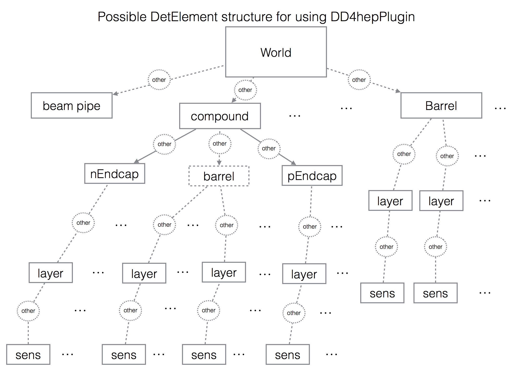

# DD4hep plugin

:::{todo}
Describe new markup and construction for DD4hep plugin and building layerless geometry.
:::

The DD4hepPlugin allows building of a {class}`Acts::TrackingGeometry` from
[DD4hep](https://dd4hep.web.cern.ch/dd4hep/) input. DD4hep uses [ROOT](https://root.cern.ch) TGeo as the underlying geometry model.

:::{note}
Previous versions of ACTS (prior to `v20.0.0`) used a different integration
mechanism. Please refer to the documentation of prior versions for more information.
:::

## General

The basic input for building the detector are a detector description in the
XML file format and a corresponding detector constructor written in C++. These
two components have to be changed accordingly. Detector constructors use these
XML files as an input and construct a detector in the DD4hep geometry format.
The whole detector is segmented into different detector parts, e.g. barrels
and endcaps which describe different sub-detectors. Since these sub-detectors
are built differently, they need different detector constructors. In this way
one detector description in XML can use various detector constructors, needed
for the different kinds of detector parts.

In the detector description model of DD4hep any detector is a tree of instances
of the so-called `DetElement` class. This `DetElement` class provides all
needed detector information, e.g. readout segmentation, geometrical information,
environmental conditions. This tree is parallel to the volume tree, which
provides the `TGeoVolumes` and their placements. The relation between these
two trees is one-directional, i.e. every volume can be accessed via its
corresponding `DetElement`, but not vice versa. Not every supporting material
will be declared as a detector element, hence, the geometrical tree can have a
deeper hierarchy structure. In order to access both, detector specific and
geometrical information, the conversion to the tracking geometry navigates
through the detector tree. The `DetElement` can also be extended, to add
specific features or to access information. This extension mechanism is used
during the translation process.

The ACTS DD4hep plugin inspects the geometry hierarchy and searches for
sensitive detector elements and passive material structures.  ACTS identifies
relevant parts of the detector by DD4hep's `DetType` (see
[documentation](https://dd4hep.web.cern.ch/dd4hep/reference/classdd4hep_1_1DetType.html#ae353f4bccf0f288793526efa10866af2)),
which can be set from XML. ACTS will attempt to translate detector elements
marked as `DetType::TRACKER`. `DetType::BARREL` and `DetType::ENDCAP` tell ACTS
to convert a detector element as a sensitive volume, while the beampipe is
identified by `DetType::BEAMPIPE`.

In addition, ACTS looks for specific markup that can be attached to
detector elements via XML or from the experiment specific geometry driver /
factory.

## ACTS specific markup

In cases where ACTS requires information that is not accessible or derivable
from DD4hep data, it will look for additional parameters that mark up detector
elements. One such example is the layer pattern. ACTS looks for detector
elements which represent subdetectors, identified by `DetType::BARREL` and
`ENDCAP`. To group sensors into layers correctly, it will search for the
detector element corresponding to a layer **by name**. Which detector element
names are interpreted as *layers* is steered by the `layer_pattern`
parameter. It contains a regex that is evaluated against every detector element
name encountered. It can be set from the XML using DD4hep's plugin mechanism
and the provided `ParametersPlugin` like:

```xml
<detector id="ODD_PixelEndcapN_ID" name="PixelEndcapN"
          type="ODDPixelEndcap" readout="PixelEndcapReadout" vis="invisible">
  <type_flags type="DetType_TRACKER + DetType_ENDCAP"/>
  <!-- ... -->
</detector>
<!-- ... -->
<plugins>
  <plugin name="DD4hep_ParametersPlugin">
    <argument value="PixelEndcapN"/>
    <argument value="layer_pattern: str=PixelEndcapN\d|PixelEndplate"/>
  </plugin>
</plugins>
```

In this snippet, `ParametersPlugin` assigns a value of `layer_pattern:
str=PixelEndcapN\d|PixelEndplate` to the detector of name `PixelEndcapN`.
ACTS uses this parameter to resolve the layer detector elements.


## `DD4hepDetectorElement`

In ACTS the surfaces describing the sensitive modules of a detector are directly
linked to these of the initial geometry input. In the case of DD4hep the
{class}`Acts::DD4hepDetectorElement` was introduced which is the direct link of
ACTS to DD4hep. In the case for tracking relevant parameters in the DD4hep
geometry description are changed (e.g. alignment) it will be automatically
changed in ACTS.

## Build

The DD4hepPlugin is only build on demand. The DD4hepPlugin depends on the
TGeoPlugin therefore both plugins need to be installed. During the cmake
configuration the flags `ACTS_BUILD_PLUGIN_DD4HEP=on` and
`ACTS_BUILD_PLUGIN_ROOT=on` need to be set. In addition, ROOT and DD4hep
installations need to be available to cmake.

## Prerequisites

To guarantee a working translation from DD4hep input to ACTS geometry the
following conditions need to be met:

- The detector needs to have a barrel-endcap structure: Every hierarchy of
  subdetectors (e.g. PixelDetector, StripDetector,...) needs to be decomposed
  into

  1. {barrel}
  2. {barrel + 2 endcaps}
  3. {2 endcaps} - in case there is no barrel at this stage (e.g. forward end caps)

  These subdetectors need to be flagged using the correct `DetType`.

- If a hierarchy is not only a single barrel but is decomposed of a barrel
  and its corresponding endcaps they need to be grouped together in an
  assembly using the `DD4hep_SubdetectorAssembly` constructor which is
  provided by DD4hep. Example of usage in xml file (where Barrel0, nEndCap0
  and pEndCap0 are sub detectors defined in the file `PixelTracker.xml`):

  ```xml
  <include ref="PixelTracker.xml"/>
  <detectors>
    <detector id="1" name="PixelTracker" type="DD4hep_SubdetectorAssembly"
              vis="BlueVisTrans">
      <shape name="PixelEnvelope" type="Tube" rmin="Env0_rmin"
             rmax="Env0_rmax"dz="Env0_dz" material="Air"/>
      <composite name="Barrel0"/>
      <composite name="nEndCap0"/>
      <composite name="pEndCap0"/>
    </detector>
  </detectors>
  ```

  If a user wants to create his/her own constructor to group these
  volumes together the type needs to be set to "compound".

- Since the translation walks through the `DetElement` tree the following
  objects need to be declared as a DD4hep `DetElement`:
  - The subvolumes e.g. barrel, endcap, beampipe (they are usually built with
    different DD4hep constructors and are therefore DD4hep `DetElement`'s
    per default).
  - Layers when containing sensitive material and/or the layer should
    carry material (which will be mapped on the layer if indicated), or
    the layer is sensitive itself.

    ```{note}
    The layer does not need to be a direct child of the volume (barrel or
    endcap), it an be nested in substructures
    ```

  - Sensitive detector modules

    ```{note}
    The sensitive detector modules need to be placed in a layer however
    it can be nested in substructures (can be a component of a modules)
    i.e. it does not need to be a direct child of the layer
    ```

- The tracking geometry needs to be built from bottom to top to ensure
  navigation. Therefore, the different hierarchies need to be sorted ascending.
  Per default the sub detectors are sorted by the id of their `DetElement`.
  In case another sorting needs to be applied, the users can provide their own
  function.

There are two modes building the layers around the sensitive detector modules:

- The `DetElement` containing the sensitive modules have a geometrical
  shape.
  The boundaries of the layers in ACTS are taken directly from the given shape.

- The `DetElement` containing the sensitive modules have no specific shape
  (assembly).
  The boundaries of the layers are calculated automatically by adding a
  tolerance to the geometric extension of the contained surfaces. The
  tolerances in r and z need to be set for every `DetElement` representing
  layer using DD4hep parameters `envelope_r_min`, `envelope_r_max`,
  `envelope_z_min`, `envelope_z_max`. attached to the layer detector
  element. (see [](acts-params))

  ```{note}
  Either all or none of the `envelope_*` parameters need to be set.
  ```


The volumes are automatically built around the layers. Volume boundaries for
the volumes are calculated automatically by adding a tolerance to the geometric
extension of the contained layers. The tolerance parameters `layerEnvelopeR`
and `layerEnvelopeZ` need to be set in the
{func}`Acts::convertDD4hepDetector` function.

Furthermore, parameters can be handed over for material mapping or the axes
orientation of modules.

Summing up the `DetElement` tree in DD4hep should have the following
structure:



It is also possible to translate a very simple detector geometry, which just
consists of cylindrical (for a barrel) or disc (for endcaps) layers which either
have material, or, are declared sensitive in DD4hep themselves without
containing any detector modules.

(acts-params)=
## Possible parameters ACTS will interpret

ACTS geometry translation uses parameters attached to DD4hep detector elements via the `VariantParameters` extension. You can set this extension from your factory code, or use DD4hep's plugin mechanism to set parameters on detector elements via name. Here's an excerpt from the Open Data Detector on how to use this to mark a passive structure as a *passive layer*:

```xml
<lccdd>
  <detectors>
    <detector id="ODD_Solenoid_ID" name="Solenoid" type="ODDCylinder" beampipe="false" vis="Aluminum">
      <type_flags type="DetType_TRACKER" />
      <boundary_material surface="inner" binning="binPhi,binZ" bins0="mat_sol_bPhi" bins1="mat_sol_bZ"/>
      <tubs name="Solenoid" rmin="sol_rmin" rmax="sol_rmax" dz="sol_hlength" material="Aluminum">
        <layer_material surface="representing" binning="binPhi,binZ" bins0="mat_sol_bPhi" bins1="mat_sol_bZ"/>
      </tubs>
    </detector>
  </detectors>

  <plugins>
    <plugin name="DD4hep_ParametersPlugin">
      <argument value="Solenoid"/>
      <argument value="passive_layer: bool = true"/>
    </plugin>
  </plugins>
</lccdd>
```

* Layer

  * `envelope_{r,z}_{min,max}`: explicit envelope for a layer
  * `layer_material`: mark a layer as passive (use this if you want to add a passive layer that is not a beampipe)
  * Surface binning:

    * `surface_binning`: set to true to indicate that explicit surface binning is set.
    * `surface_binning_n_{phi,r}`: surface binning for a layer

  * Layer material:

    * `layer_material`: set to true to indicate that the layer has layer material configuration

      * `layer_material_representing`: set to true to indicate representing layer material
      * `layer_material_inner`: set to true to indicate inner layer material
      * `layer_material_outer`: set to true to indicate outer layer material
      * `layer_material_{representing,inner,outer}_bin{X,Y,Z,R,Phi,RPhi,H,Eta,Mag}` to give the number of bins in a direction

* Sensor

  * `axis_definitions`: local axis definitions for a sensor. Default: `XYZ`. See {class}`Acts::DD4hepDetectorElement` for details

* Volume / subdetector

  * `boundary_material`: set to true to indicate boundary material is set
  * `boundary_material_{negative,positive,inner,outer}` to indicate which boundary material surfaces should be set
  * `boundary_material_{negative,positive,inner,outer}_bin{X,Y,Z,R,Phi,RPhi,H,Eta,Mag}` to give the number of bins in a direction

## Usage

To receive the {class}`Acts::TrackingGeometry` the global function
{func}`Acts::convertDD4hepDetector` should be used, where the DD4hep world
`DetElement` needs to be handed over. For a valid translation, that all
prerequisites described above are met and that the right `VariantParameters`
are added during the DD4hep construction.


## DD4hep field adapter

The DD4hep plugins ships with an adapter class that connects a DD4hep-defined
field to the {class}`Acts::MagneticFieldProvider` interface:

:::{doxygenclass} Acts::DD4hepFieldAdapter
:::
