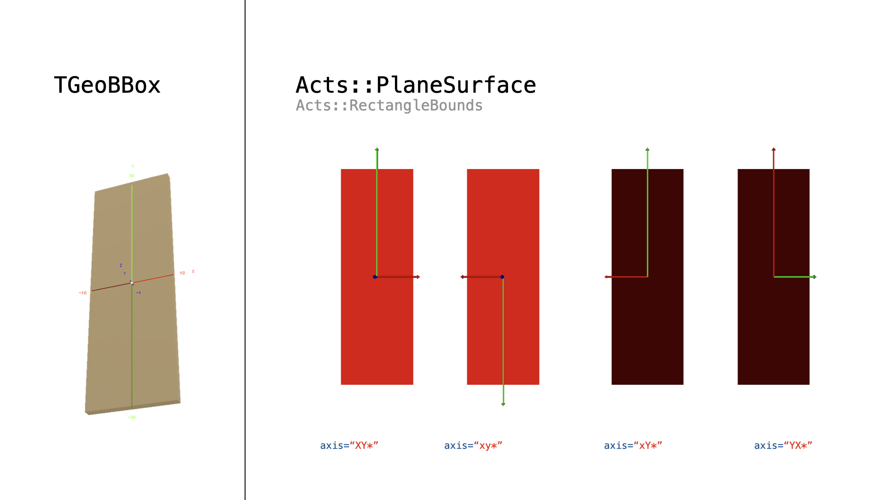
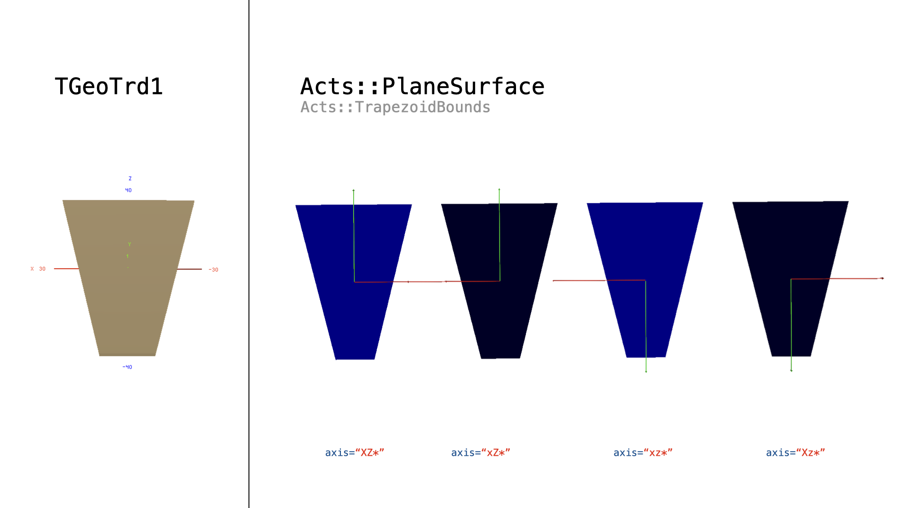
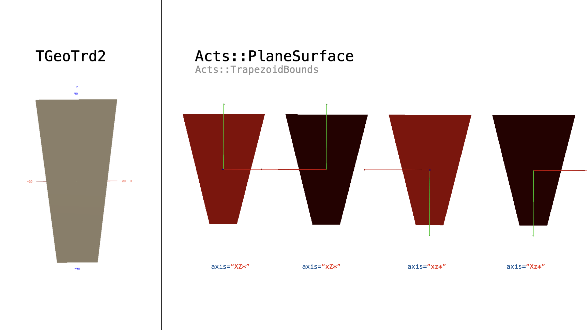
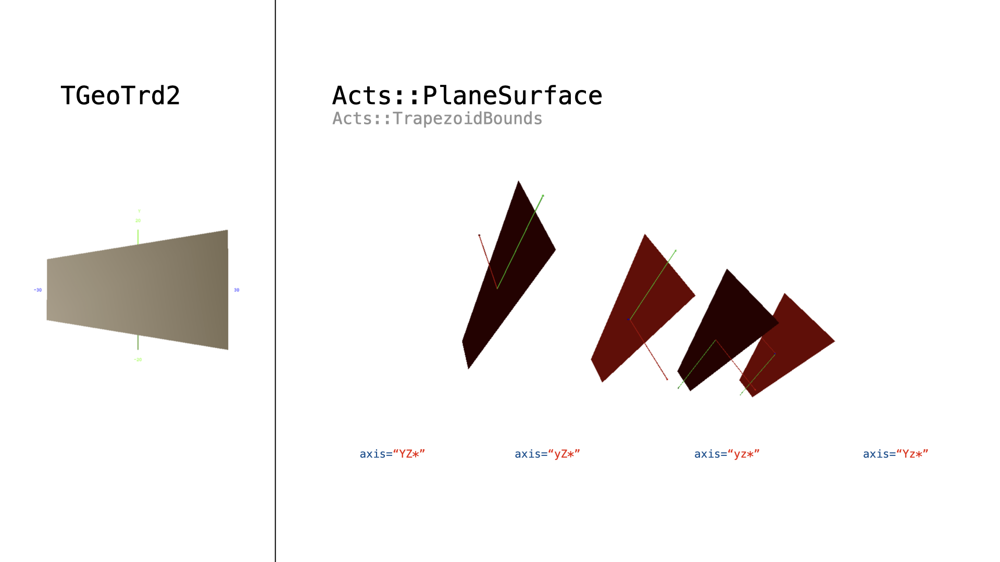
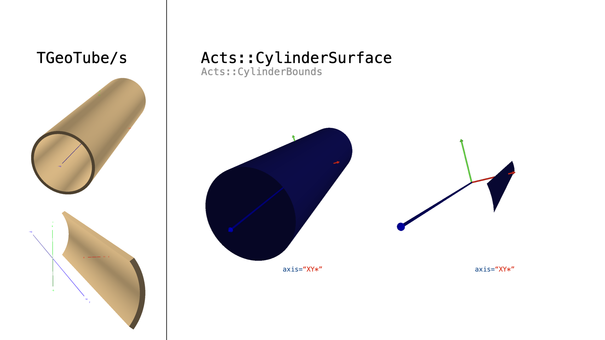
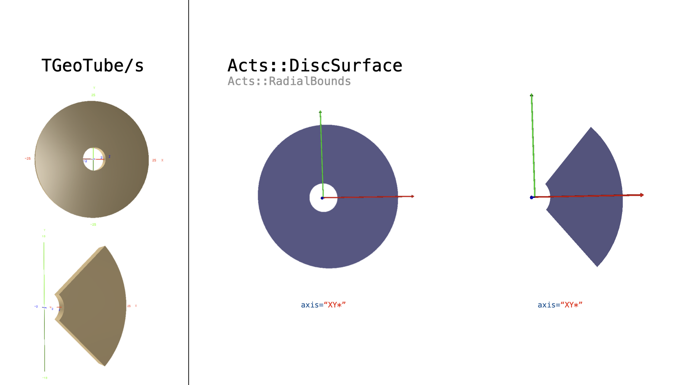

ROOT plugin
===========

General
-------

The ``Root`` plutin provides geometry and I/O components to ACTS from the ROOT framework.

Geometry
--------

The ``Root`` plugin connects a geometry described with the ``ROOT::Geom`` module with ACTS. This is done by parsing the ROOT geometry and selecting ``TGeoNode`` objects that represent chosen geometrical objects.
ACTS detector elements are represented by surfaces with dedicated shapes, hence a conversion of the volume based ``TGeoNode`` description into ``Acts::Surface`` objects needs to take place.

An example use of the ``TGeo`` plugin can be found in the ``TGeoDetector`` example.

Parsing the ROOT Geometry
-------------------------

Once a geometry is imported in ROOT, it can be accessed via the ``gGeoManager``. The ``Acts::TGeoLayerBuilder``, which implements an ``Acts::ILayerBuilder``, relies on the fact that this ``gGeoManager`` is accessible, if it points to ``nullptr``, obviously no conversion is done.
The ``Acts::TGeoLayerBuilder`` can be configured to search within given parsing ranges for ``TGeoNode`` objects to be converted into ``Acts::Surface`` objects. A vector of search strings can be used for situations where multiple sensor types are used or additional objects are bound to be described.
A dedicated ``Acts::TGeoParser`` struct is then used to select the nodes from the ROOT geometry.

Conversion of TGeoShapes to Acts::Surfaces
------------------------------------------

An automatic translation of ``TGeoShape`` objects into corresponding ``Acts::Surface`` objects with appropriate bound descriptions is done by the ``Acts::TGeoSurfaceConverter`` class.
There is some limited freedom in re-defining the orientation of the coordinate system between ROOT and ACTS which can be used to adapt local coordinate definitions on the converted objects.
This is indicated by the ``const std::string& axes`` argument of the converter.

The nomenclature/convention is the following:
 * the resulting local cartesian coordinate system must by right-handed: this is guaranteed by the fact that the third local axis is constructed as a cross product of the first two local axis
 * defining the new local axes with respect to the ``TGeo`` definition is done by naming the new axes in order, e.g. an unchanged coordinate system has the tag ``XYZ``, or ``XY*``, as the third axis is defined by the first two ones
 * flipping the direction of a axis is done by lower capital, e.g. ``yZ*`` redefines the negative y-axis of the ``TGeoMatrix`` as the (obviously) positive x-axis of the ``Acts::Transform3`` and redefines the positive z-axis of the ``TGeoMatrix`` as corresponding y-axis of the ``Acts::Transform3``

In case a translation request is malformed, a ``std::exception`` is thrown, indicating the problem.

Examples of supported ``TGeoShape`` transformations to ``Acts::Surface`` objects can be found in the ``Tests/UnitTests/Plugins/Root`` unit test suite, a summary of the output can be seen below.

Additionally, an option exists to split surfaces after the transformation
has taken place by adding a splitter implementation to the ``Acts::TGeoLayerBuilder``, like the ``Acts::TGeoCylinderDiscSplitter``. This can be useful to describe e.g. a cylindrical detector with tangential planar surfaces.

  Conversion of a ``TGeoBBox`` shape into a ``Acts::PlaneSurface`` with ``Acts::RectangleBounds``. All axes iterations are allowed for this conversion.

  Conversion of a ``TGeoTrd1`` shape into a ``Acts::PlaneSurface`` with ``Acts::TrapezoidBounds``. The axes definitions need to be ``(x/X)(z/Z)(*/*)``.

  Conversion of a ``TGeoTrd2`` shape into a ``Acts::PlaneSurface`` with ``Acts::TrapezoidBounds``. The axes definitions shown are ``(x/X)(z/Z)(*/*)``, the second coordinate has to be the z-axis.

  Conversion of a ``TGeoTrd2`` shape into a ``Acts::PlaneSurface`` with ``Acts::TrapezoidBounds``. The axes definitions shown are ``(y/Y)(z/Z)(*/*)``, the second coordinate has to be the z-axis.

  Conversion of a ``TGeoTube`` shape into a ``Acts::CylinderSurface`` with ``Acts::CylinderBounds``. The axes definitions has to be ``(x/X)(y/Y)(*/*)``.

  Conversion of a ``TGeoTube`` shape into a ``Acts::DiscSurface`` with ``Acts::DiscBounds``.The axes definitions has to be ``(x/X)(y/Y)(*/*)``.
